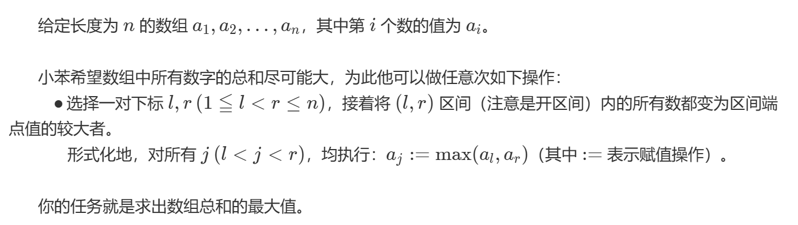
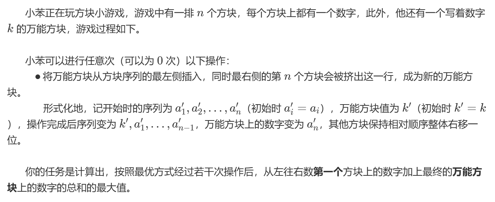
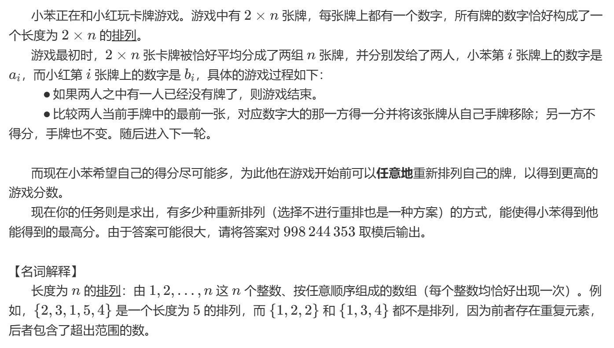
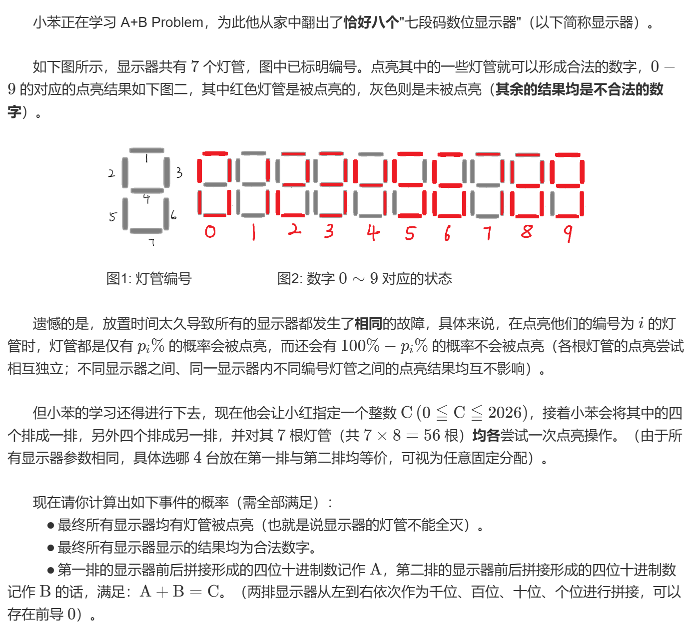
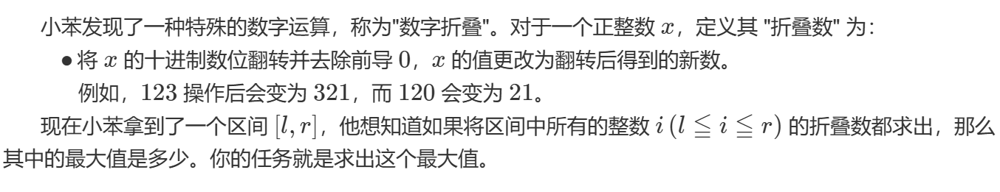
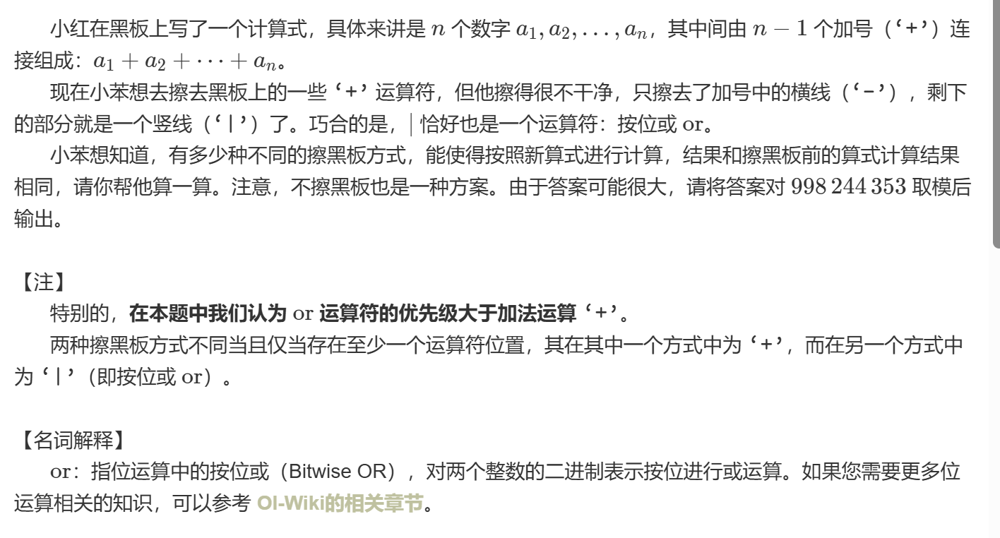

# 26 寒假训练
## 第一场
### L Need Zero[Need Zero](https://ac.nowcoder.com/acm/contest/120561/L)
遍历x 1-10，找到 最小的 满足条件的即可。

### K Constructive [K Constructive](https://ac.nowcoder.com/acm/contest/120561/K)
给定一个 n，构造一个长度为n的数组，每个元素都是正整数，乘积等于元素的和，且元素互不相同。

> 观察发现，除了n为1的时候有解，其余时侯均无解。

### C Array Covering [C Array Covering](https://ac.nowcoder.com/acm/contest/120561/C)

观察可以得到 边界值几乎无法改变，一般情况下为中间最大值*（n-2）+首尾两侧数值。
在考虑最大值在首尾的情况。

### E Block Game[Block Game](https://ac.nowcoder.com/acm/contest/120561/E)

意思是相邻两个数字的和，最后一个和第一个相接。

### B Card Game[B Card Game](https://ac.nowcoder.com/acm/contest/120561/B)

如果从大到小排列，一定能得到最高分。

小红 牌最小为a，
小本比a大的x张。小的y张，结果为`x!*y! % 998244353`

取模需要在 计算阶乘的时候就要计算，否则会在计算过程中就 爆破。

### A A+B Problem[A+B Problem](https://ac.nowcoder.com/acm/contest/120561/A)

上下的内容无所谓。
求出得到每一个数字$t_i$的概率。

当前位是 8的概率是 $p_1 \times p_2 \times \ldots \times p_8$  
等等等等---

***取模***
$(a+b)%p = ((a%p) + (b%p)) % p$
$(a\times b)%p = ((a%p) \times (b%p)) % p$
$(a-b)%p = ((a%p) - (b%p) + p) % p$
$(a/b)%p = ((a%p) * (pow(b, p-2, p))) % p$
> 费马定理
> 如果 $p$是质数，则对于任意不能被$p$整除的整数$a$，有 $a^{p-1} \equiv 1 \mod p$。
> 即$a \times a^{p-2} \equiv 1 \mod p$。
> 如果$p$是质数，对于任意整数$a$,有 $a^p \equiv a \mod p$。
> 设$a$的逆元是$x$,那么有 $ax \equiv 1 \mod p$。

> 快速幂
> $a^b mod p$
> 可以通过倍增的方法来计算模p意义下的$a^1 a^2 a^4 \ldots$再根据b的二进制表示来计算。

> 这个题目要用到快速幂进行计算

### G Digital Folding [Digital Folding](https://ac.nowcoder.com/acm/contest/120561/G)

1. 找到相同的前缀，从不同的位置开始处理。
2. 尽量找 99999结尾的。
3. 尝试从高位借位，但是 l和r相同的位不能处理。

### H Blackboard[Blackboard](https://ac.nowcoder.com/acm/contest/120561/H)

这里是或运算和加运算。
或运算中，有1 是1，加运算中会产生新的 1.
所以 或运算的结果<=加运算的结果。

所以，或结果与加结果相同时候才能满足。

`a+b = a|b + a&b`  =>  `a&b == 0`
or
`a+b = a^b + (a&b)<<1`

### I AND vs MEX
[IAND vs MEX](https://ac.nowcoder.com/acm/contest/120561/I)

