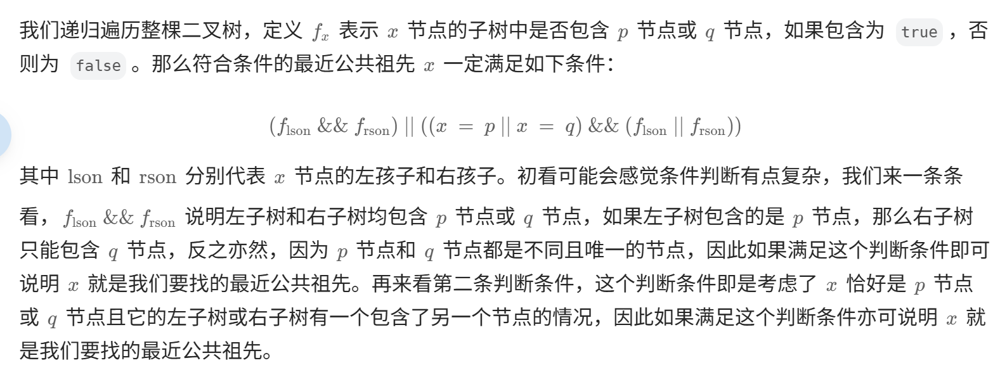
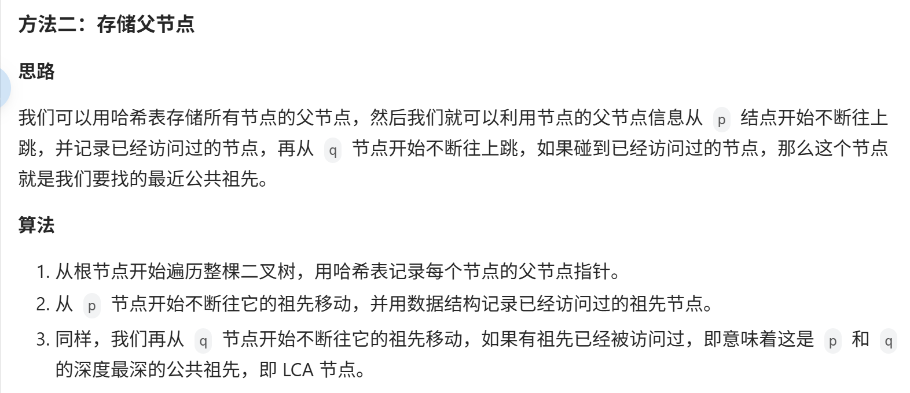
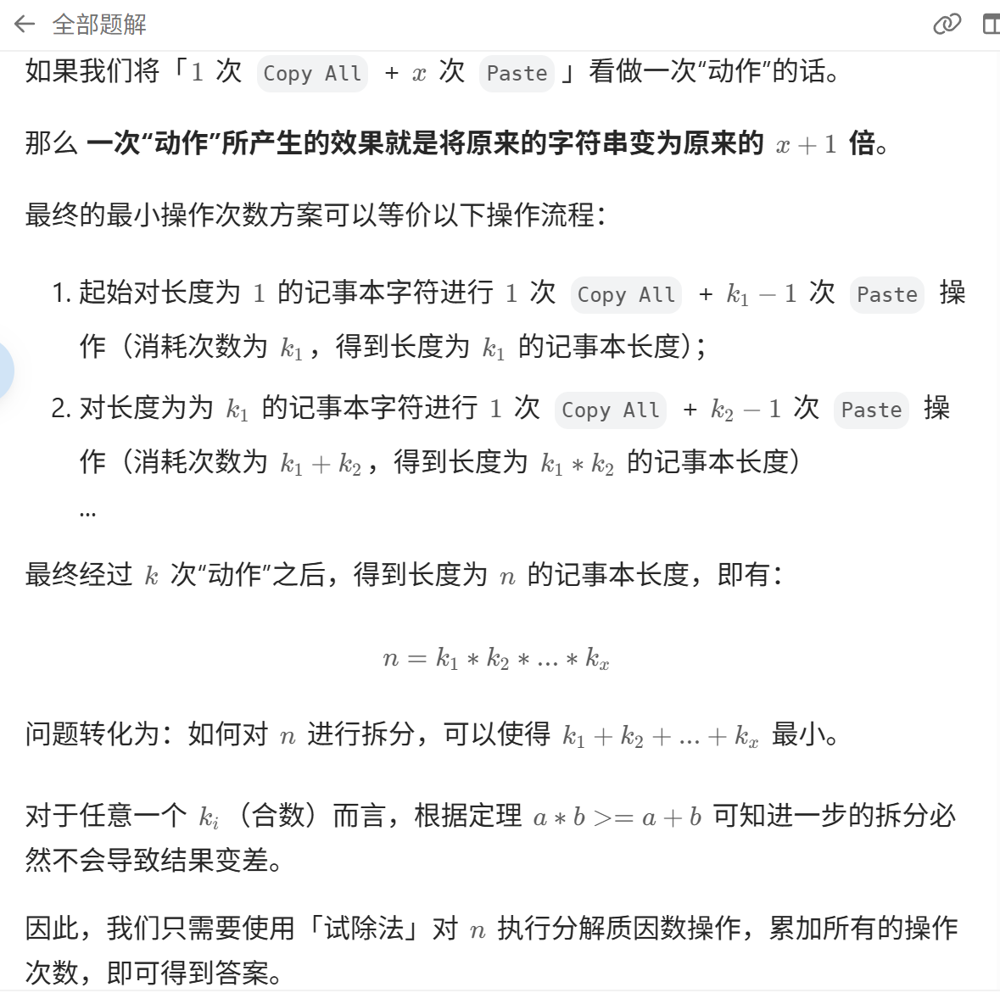

#### *049.求根节点到叶子节点的数字之和*
方法一：深度优先搜索
思路与算法

深度优先搜索是很直观的做法。从根节点开始，遍历每个节点，如果遇到叶子节点，则将叶子节点对应的数字加到数字之和。如果当前节点不是叶子节点，则计算其子节点对应的数字，然后对子节点递归遍历。
 方法二：广度优先搜索
思路与算法

使用广度优先搜索，需要维护两个队列，分别存储节点和节点对应的数字。

初始时，将根节点和根节点的值分别加入两个队列。每次从两个队列分别取出一个节点和一个数字，进行如下操作：

如果当前节点是叶子节点，则将该节点对应的数字加到数字之和；

如果当前节点不是叶子节点，则获得当前节点的非空子节点，并根据当前节点对应的数字和子节点的值计算子节点对应的数字，然后将子节点和子节点对应的数字分别加入两个队列。

搜索结束后，即可得到所有叶子节点对应的数字之和。

#### *050.路径总和*
思路：前缀和
解题过程

维护当前和，记录过去和的数量，当差值出现target代表出现和为target带路径


 #### *22.括号生成*
方法一：暴力法
思路:
    我们可以生成所有 2^n个 ‘(’ 和 ‘)’ 字符构成的序列，然后我们检查每一个是否有效即可。

#### *3488.距离最小相等元素查询*

> 看示例 1，所有 1 的下标列表是 p=[0,2,4]。
    由于 nums 是循环数组：
    在下标列表前面添加 4−n=−3，相当于认为在 −3 下标处也有一个 1。   
    在下标列表末尾添加 0+n=7，相当于认为在 7 下标处也有一个 1。
        p[j−1] 就是在 i 左边的最近位置。
        p[j+1] 就是在 i 右边的最近位置。
        两个距离取最小值，答案为    min(i−p[j−1],p[j+1]−i)
    如果 nums[i] 在 nums 中只出现了一次，那么答案为 −1。
```cpp
class Solution {
public:
    vector<int> solveQueries(vector<int>& nums, vector<int>& queries) {
        unordered_map<int, vector<int>> indices;        //哈希表<int,vector<int>> 用于存储数字和坐标
        for (int i = 0; i < nums.size(); i++) {
            indices[nums[i]].push_back(i);              //输入num[i] 的当前的坐标
        }

        int n = nums.size();                            //数组大小
        for (auto& [_, p] : indices) {
            // 前后各加一个哨兵
            int i0 = p[0];                              //保存第一个元素
            p.insert(p.begin(), p.back() - n);          //在首位插入哨兵，哨兵值为末位置值-n
            p.push_back(i0 + n);                        //在末尾插入哨兵，哨兵值为i0+n
        }
        //哨兵值为循环数组坐标

        for (int& i : queries) {                        // 注意这里是引用
            auto& p = indices[nums[i]];                 // 这里应该也是引用
            if (p.size() == 3) {                        //判断大小 如果是3 则本数字在数组中只出现了1次，所以没有重复的数字。标记为-1；  答案直接存储在了queries里面，节省了存储空间。
                i = -1;
            } else {
                int j = ranges::lower_bound(p, i) - p.begin();//这行代码在数组p中查找第一个大于等于i的元素位置，并返回该位置的索引。
                i = min(i - p[j - 1], p[j + 1] - i);    //取最小值
            }
        }
        return queries;         //询问变为答案数组。
    }
};
```
#### *38.外观数列*
-  递归 根据 n-1 的string数列，求出n的数列

#### *组合总和2*
> 给定一个候选人编号的集合 candidates 和一个目标数 target ，找出 candidates 中所有可以使数字和为 target 的组合。
  candidates 中的每个数字在每个组合中只能使用 一次 。
  注意：解集不能包含重复的组合。  

- 递归回溯


#### *235.二叉搜索树的最近公共祖先*
> 百度百科中最近公共祖先的定义为：“对于有根树 T 的两个结点 p、q，最近公共祖先表示为一个结点 x，满足 x 是 p、q 的祖先且 x 的深度尽可能大（一个节点也可以是它自己的祖先）。”

==两次遍历==
- 注意到题目中给出的是一棵「二叉搜索树」，因此我们可以快速地找出树中的某个节点以及从根节点到该节点的路径
- 我们可以在路径中找到，最终的相同的深度。

==一次遍历==
- 我们从根节点开始遍历；
- 如果当前节点的值大于 p 和 q 的值，说明 p 和 q 应该在当前节点的左子树，因此将当前节点移动到它的左子节点；
- 如果当前节点的值小于 p 和 q 的值，说明 p 和 q 应该在当前节点的右子树，因此将当前节点移动到它的右子节点；
- 如果当前节点的值不满足上述两条要求，那么说明当前节点就是「分岔点」。此时，p 和 q 要么在当前节点的不同的子树中，要么其中一个就是当前节点。

#### *236.二叉树的最近公共祖先*

==题解一：递归==

==题解二：存储父节点==

```cpp
class Solution {
public:
    unordered_map<int, TreeNode*> fa;
    unordered_map<int, bool> vis;
    void dfs(TreeNode* root){
        if (root->left != nullptr) {
            fa[root->left->val] = root;
            dfs(root->left);
        }
        if (root->right != nullptr) {
            fa[root->right->val] = root;
            dfs(root->right);
        }
    }
    TreeNode* lowestCommonAncestor(TreeNode* root, TreeNode* p, TreeNode* q) {
        fa[root->val] = nullptr;
        dfs(root);
        while (p != nullptr) {
            vis[p->val] = true;
            p = fa[p->val];
        }
        while (q != nullptr) {
            if (vis[q->val]) return q;
            q = fa[q->val];
        }
        return nullptr;
    }
};

```

#### *43.字符串相乘*
> 方法一：做加法
    如果 num 1  和 num2  之一是 0，则直接将 0 作为结果返回即可。
    如果 num 1  和 num 2 都不是 0，则可以通过模拟「竖式乘法」的方法计算乘积。从右往左遍历乘数，将乘数的每一位与被乘数相乘得到对应的结果，再将每次得到的结果累加。这道题中，被乘数是 num 1 ，乘数是 num 2 。
   -  需要注意的是，num 2 除了最低位以外，其余的每一位的运算结果都需要补 0。
```cpp
class Solution {
public:
    string multiply(string num1, string num2) {
        //如果 其中有一个是0 结果一定是0
        if (num1 == "0" || num2 == "0") {
            return "0";
        }

        string ans = "0";//存储答案
        int m = num1.size(), n = num2.size();
        for (int i = n - 1; i >= 0; i--) {
            //从右向左便遍历 对于num1 
            string curr;//存储当前的结果
            int add = 0;
            //补充0 位
            for (int j = n - 1; j > i; j--) {
                curr.push_back(0);
            }
            int y = num2.at(i) - '0'; //y是 num1 第i位置的数值
            for (int j = m - 1; j >= 0; j--) {
                int x = num1.at(j) - '0';   //num2 第j位
                int product = x * y + add;  //求取当前位置的
                curr.push_back(product % 10);
                add = product / 10;         //add是进位
            }
            while (add != 0) {
                curr.push_back(add % 10);//补充进位
                add /= 10;
            }
            reverse(curr.begin(), curr.end());
            for (auto &c : curr) {
                c += '0';                   //补充‘0’ 使得转变为了字符数字
            }
            ans = addStrings(ans, curr);    //添加字符串 计算  字符串相加计算
        }
        return ans;
    }

    string addStrings(string &num1, string &num2) {
        int i = num1.size() - 1, j = num2.size() - 1, add = 0;  //从右到左遍历
        string ans;                                             //答案
        while (i >= 0 || j >= 0 || add != 0) {                  //有一个字符串没有遍历完 或者进位非零
            int x = i >= 0 ? num1.at(i) - '0' : 0;              
            int y = j >= 0 ? num2.at(j) - '0' : 0;
            int result = x + y + add;                           //当前位计算结果
            ans.push_back(result % 10);                         //放入结果
            add = result / 10;                                  //更新进位
            i--;                                                    
            j--;                                                //更新 i 和 j
        }
        reverse(ans.begin(), ans.end());                        //翻转
        for (auto &c: ans) {
            c += '0';                                           //同理更新字符
        }
        return ans;
    }
}; 
```
> 方法二：
> 方法一的做法是从右往左遍历乘数，将乘数的每一位与被乘数相乘得到对应的结果，再将每次得到的结果累加，整个过程中涉及到较多字符串相加的操作。如果使用数组代替字符串存储结果，则可以减少对字符串的操作。
> 令 m 和 n 分别表示 num 1  和 num 2  的长度，并且它们均不为 0，则 num 1  和 num 2  的乘积的长度为 m+n−1 或 m+n。简单证明如下：如果num 1  和 num 2  都取最小值，则 num 1 =10 m−1 ，num 2 =10 n−1 ，num 1 ×num 2 =10 m+n−2 ，乘积的长度为 m+n−1；如果 num 1  和 num 2  都取最大值，则 num 1 =10 m −1，num 2 =10 n −1，num 1 ×num 2 =10 m+n −10 m −10 n +1，乘积显然小于 10 m+n  且大于 10 m+n−1 ，因此乘积的长度为 m+n。由于 num 1  和 num 2​  的乘积的最大长度为 m+n，因此创建长度为 m+n 的数组 ansArr 用于存储乘积。对于任意 0≤i <  m 和 0≤j < n ，num 1 [i]×num 2​ [j] 的结果位于 ansArr[i+j+1]，如果 ansArr[i+j+1]≥10，则将进位部分加到 ansArr[i+j]。
> 最后，将数组 ansArr 转成字符串，如果最高位是 0 则舍弃最高位。
```cpp
class Solution {
public:
    string multiply(string num1, string num2) {
        if (num1 == "0" || num2 == "0") {
            return "0";
        }
        int m = num1.size(), n = num2.size();
        auto ansArr = vector<int>(m + n);
        for (int i = m - 1; i >= 0; i--) {
            int x = num1.at(i) - '0';
            for (int j = n - 1; j >= 0; j--) {
                int y = num2.at(j) - '0';
                ansArr[i + j + 1] += x * y;
            }
        }
        for (int i = m + n - 1; i > 0; i--) {
            ansArr[i - 1] += ansArr[i] / 10;
            ansArr[i] %= 10;
        }
        int index = ansArr[0] == 0 ? 1 : 0;
        string ans;
        while (index < m + n) {
            ans.push_back(ansArr[index]);
            index++;
        }
        for (auto &c: ans) {
            c += '0';
        }
        return ans;
    }
};
```
#### *257.二叉树的所有路径*
> 题解1 ： dfs
> 题解2 ： bfs

```cpp
class Solution {
public:
    vector<string> binaryTreePaths(TreeNode* root) {
        vector<string> paths;
        if (root == nullptr) {
            return paths;
        }
        queue<TreeNode*> node_queue;
        queue<string> path_queue;

        node_queue.push(root);
        path_queue.push(to_string(root->val));

        while (!node_queue.empty()) {
            TreeNode* node = node_queue.front(); 
            string path = path_queue.front();
            node_queue.pop();
            path_queue.pop();

            if (node->left == nullptr && node->right == nullptr) {
                paths.push_back(path);
            } else {
                if (node->left != nullptr) {
                    node_queue.push(node->left);
                    path_queue.push(path + "->" + to_string(node->left->val));
                }

                if (node->right != nullptr) {
                    node_queue.push(node->right);
                    path_queue.push(path + "->" + to_string(node->right->val));
                }
            }
        }
        return paths;
    }
};
```

#### *260.只出现一次的数字III*
`int mask = xor & (-xor);`
掩码：
- xor是一个原始数值
- -xor 是 xor 的二进制补码（二进制取反再加1）
- 用于寻找最低位的`0`

> 根据最右侧的 最低位的1 进行分治 注意爆int
```cpp
// 步骤1: 对所有元素进行异或操作
    long long int xorResult = 0;
    for (int num : nums) {
        xorResult ^= num;
    }
    
    // 步骤2: 找到异或结果中最右边的1
    long long int mask = xorResult & (-xorResult);
    
    // 步骤3: 根据该位将数组分成两组并分别异或
    vector<int> result(2, 0);
    for (int num : nums) {
        if (num & mask) {
            result[0] ^= num;
        } else {
            result[1] ^= num;
        }
    }
    
    return result;
```
> 根据最高位的1 进行分治
```cpp
class Solution {
public:
    vector<int> singleNumber(vector<int>& nums) {
        //首先得到两个元素的异或值
        size_t sum = 0;
        for(int i = 0; i < nums.size(); ++i)
        {
            sum ^= nums[i];
        }
        //找到第一个1
        int pos = 0;
        for(int j = 0; j < 32; ++j)
        {
            int _sum = sum >> j;
            if(_sum & 1)
            {
                pos = j;
            }
        }
        //分批次异或
        vector<int> v(2, 0);
        for(int i = 0; i < nums.size(); ++i)
        {
            if((nums[i] >> pos) & 1)
            {
                v[0] ^= nums[i];
            }
            else
            {
                v[1] ^= nums[i];
            }
        }
        return v;
    }
};
```

#### *402.移掉k位数字*
> 给你一个以字符串表示的非负整数 num 和一个整数 k ，移除这个数中的 k 位数字，使得剩下的数字最小。请你以字符串形式返回这个最小的数字。

> 遍历删除 左侧元素比当前元素大的话，删除左侧元素


#### *650.两个键的键盘*


1. 动态规划
    定义 $f[i][j]$ 为经过最后一次操作后，当前记事本上有 $i$ 个字符，黏贴版上有 $j$ 个字符的最小操作次数
    $as for f[i][j]  j <= i$
    最后一次的操作是*paste* 即$f[i][j]=f[i-j][j]+1$
    最后一次操作时*copy all* 即$f[i][i]=min (f[i][x] + 1)$
    *可以使用一个变量 min 保存前面转移的最小值，用来更新最后的$f[i][j]$*
    
2. 数学
    
3. 打表
4. dfs
    ```cpp
        // DFS递归
    public static int minSteps(int n) {
        if (n == 1) return 0;
        return dfs(n, 1, 0);
    }

    // n：固定参数，要达到的目标（输出n个'A'）
    // cur：当前记事本上已输出的'A'的数量
    // paste：当前粘贴板上已有的'A'的数量
    // 返回：在当前cur、paste的情况下，达到目标，所需要的最少操作次数
    private static int dfs(int n, int cur, int paste) {
        if (cur == n) return 0; // 当前记事本输出已达目标，无需操作
        if (cur > n) return INF; // 当前记事本输出超过了目标，不可能达到目标，表示之前的DFS尝试方案无效
        // 1）本次操作，选择复制（如果当前粘贴板上'A'数量 != 当前记事本上'A'数量，则可以有此选择，否则，复制操作无意义，不做此选择）：
        int p1 = cur != paste ? 1 + dfs(n, cur, cur) : INF;
        // 2）本次操作，选择粘贴（如果当前粘贴板上'A'数量 > 0，则可以有此选择，否则，粘贴操作无意义，不做此选择）：
        int p2 = paste > 0 ? 1 + dfs(n, cur+paste, paste) : INF;
        return Math.min(p1, p2);
    }

    private static final int INF = Integer.MAX_VALUE/2;
    ```
