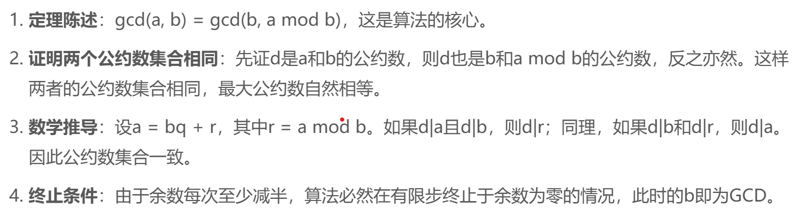
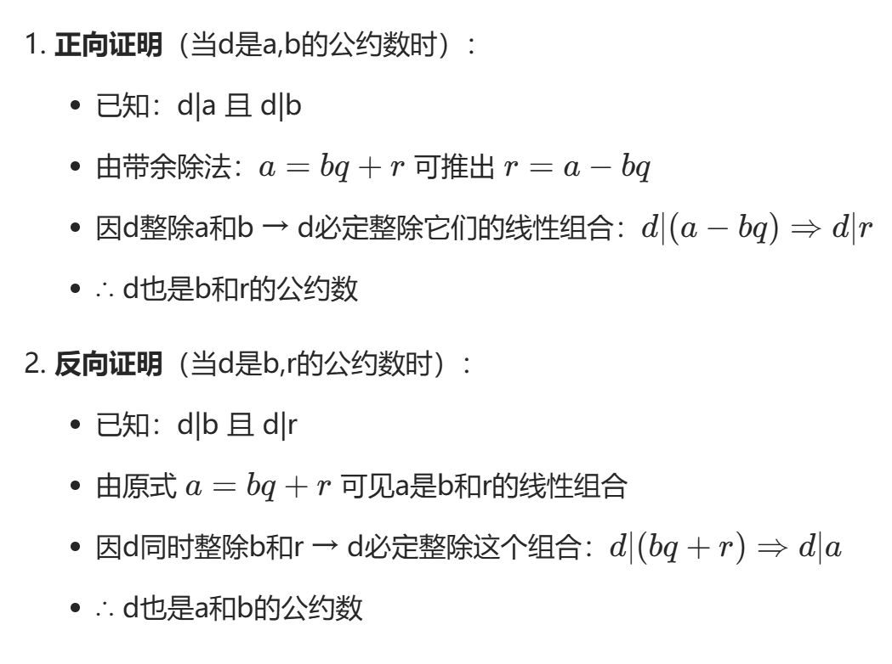
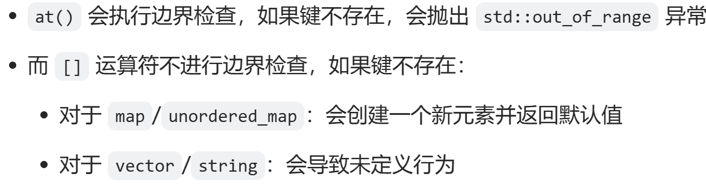

1. #include<bits/stdc++.h>   是指：包含所有的库。
2. 双指针 :   
   看模板题目 code.md中
3. 前缀和：    
   求前i个数字的和，`sum[i]=sum[i-1]+a[i]`   [l,r]  sum[r]-sum[l-1]; 从区间查询变为区间端点的查询。    
   - 前缀和可以拓展到乘法吗  `可以但是有可能溢出`
   - 可以拓展到xor吗         `可以   (a xor b xor b) == a `
   - 可以拓展到求最大值最小值吗？ `如果前n个数，后n个数的最大值可以，但不能求区间的最大值。`
  
4. 差分：  
    对于一个数列an，有q次修改，每次都把数列中li到ri的每个元素加上一个数值ki求出所有修改后的每个数字的值。   
    用数组delta[i]来维护第i个数字和前一个数字的差值，（可以默认第一个数字前面有一个0）然后当需要对[li,ri]区间的每一个数字+ki时，只需要修改delta[li]和delta[ri+1]即可。所有的修改完成后，在对delta数组求和，就可以得到数列的每个元素的数值。
5. 位运算介绍  
    << 左移  >> 右移 |或 &与 ~取反 ^异或   
    ***注意位运算的优先级***    
    `a=a^b b=a^b a=a^b ==> swap(a,b)`
6. gcd
   > 欧几里得算法的步骤：用较大数除以较小数，再用余数替换较大数，重复直到余数为零，此时的除数就是GCD
   > d|a表示d整除a
            
   
   6.1
    ``` cpp
    #include <numeric>
    // 直接使用标准库
    int result = std::gcd(a, b);
    ```
    6.2
    ```cpp
    // 递归版本
    int gcd(int a, int b) {
        if (b == 0) return a;
        return gcd(b, a % b);
    }

    // 非递归版本
    int gcd(int a, int b) {
        while (b) {
            int temp = b;
            b = a % b;
            a = temp;
        }
        return a;
    }  
    ```
7. 加速
    ios::sync_with_stdio(0), cin.tie(0), cout.tie(0);

8. **裴蜀定理**     
   对于任意两个不全为零的整数a,b 一定存在两个整数x,y 使得 ax+by=gcd(a,b)
   裴蜀定理：对于任意两个不全为零的整数a,b 一定存在两个整数x,y 使得 ax+by=(a,b)
  exgcd 是"扩展欧几里得算法"（Extended Euclidean Algorithm）的缩写。它是欧几里得算法的扩展版本。 
    基本原理
    普通的欧几里得算法只能求两个数的最大公约数(gcd)     
    扩展欧几里得算法不仅能求gcd，还能找到裴蜀定理中的系数 x和y     
    即对于任意两个整数a和b，求解方程：ax + by = gcd(a,b)    
    > 首先，考虑a和b的最大公约数d = gcd(a, b)。根据欧几里得算法，d可以通过反复应用除法算法得到，每一步的余数都可以表示为a和b的线性组合。例如，在欧几里得算法的最后一步，余数为0，此时最后的非零余数就是d。这表明d可以写成a和b的线性组合，因此存在整数x和y使得ax + by = d。
    ```cpp 
    int exgcd(int a, int b, int &x, int &y) {
    if (b == 0) {
        x = 1;
        y = 0;
        return a;
    }
    int d = exgcd(b, a % b, y, x);
    y -= (a / b) * x;
    return d;
    }
    ```

9. **连续递增的值填充**
    iota 是 C++ STL 中的一个算法，定义在 <numeric> 头文件中。它的作用是用连续递增的值填充一个范围。
    功能上：   
    ```cpp
    iota(b.begin(), b.end(), 0);

    for(int i = 0; i < b.size(); i++) {
        b[i] = i;
    }
    ```
```cpp
#include<bits/stdc++.h>
using namespace std;

bool com(const pair<int,int> &a, const pair<int,int> &b) {
    return a.first < b.first;
}

bool comp(const pair<int,int> &a, const pair<int,int> &b) {
    return a.second < b.second;
}

int main() {
    ios::sync_with_stdio(false);
    cin.tie(nullptr);
    
    int T;
    cin >> T;
    while(T--) {
        int n, k;
        cin >> n >> k;
         
        vector<pair<int,int>> a(n+1), b(n+1);
        a[0]=b[0]={-1,-1};
        for(int i = 1; i <= n; i++) {
            int tmp;
            cin >> tmp;
            a[i] = {tmp, i};
        }
        
        if(k < n ) {
            cout << "-1\n";
            continue;
        } 
        auto sum = 1ll * n * (n + 1ll) / 2;
        
        sort(a.begin(), a.end(), com);
        for(int i = 1; i <= n; i++) {
            b[i] = {i, a[i].second};
        } 
        int x = n;
        while(sum > k && x > 1){
            if(sum - k <= x - 1){
                int t = sum - k;
                sum = k;
                swap(b[1], b[t + 1]);
            }
            int t = x + x - 3;
            if(sum - t >= k){
                sum -= t;
                swap(b[x], b[x - 1]);
                x -= 1;
            }
            x -= 1;
        }
        if(sum != k){
            b[1].first = 3;
            b[2].first = 4;
            b[3].first = 1;
            b[4].first = 2;
            sum = k;
        }
          
        sort(b.begin(), b.end(), comp);
        for(int i = 1; i <= n; i++) {
            cout << b[i].first << ' ';
        }
        cout<<endl;
    }
    return 0;
}
```
10. 将数字转换为string
    ```cpp
    // 方法1：std::to_string()
    int num = 123;
    string str = std::to_string(num);

    // 方法2：stringstream
    #include <sstream>
    int num = 123;
    stringstream ss;    
    ss << num;
    string str = ss.str();

    ```
11. threesum 问题可以通过双指针减少时间复杂度
    可以使用一个i来固定最左边的坐标，left=i+1,right=len-1  不断遍历，可以减少时间复杂度。
    
12. 递归回溯
    递归：函数直接或间接调用自身的过程
    回溯：当探索的路径不满足条件时，退回到上一步，尝试另一条路径
13. KMP
    在 KMP 算法中，我们特别关注的是相同的前缀和后缀。具体来说，对于模式串的每个位置 i，我们需要找出：最长相同前缀后缀：在位置 i 之前的子串中，有多长的前缀与后缀是相同的。    **(略难，请反复回顾)**

14. isalnum()函数是一个字符检测函数，用于检查字符是否为字母数字字符（即字母或数字）。这个函数在多种编程语言中都有实现.

15. 快速乘算法
    快速乘算法是一种不使用乘法运算符而实现乘法的高效算法，主要基于二进制分解和加法运算。这种算法在特定场景（如不允许使用乘法运算符或需要处理大数乘法）中非常有用。

16. lamda表达式
    `[capture_clause](parameters) -> return_type { body }`     
17. Brian Kernighan 算法
    可以在一定程度上进一步提升计算速度。Brian Kernighan 算法的原理是：对于任意整数 x，令 x=x & (x−1)，该运算将 x 的二进制表示的最后一个 1 变成 0。因此，对 x 重复该操作，直到 x 变成 0，则操作次数即为 x 的「一比特数」。
 
 18. `pop_back()`
    用于删除最后一个元素
19. `at()`
       
    at() 更安全，但可能有轻微的性能开销
    [] 更高效，但不安全
20. string 
    ```
    C++提供了许多类似的字符和字符串处理函数，以下是一些常用的相关函数：

    ### 字符转换函数

1. **`std::toupper`** - 将字符转换为大写
   ```cpp
   #include <cctype>
   char c = 'a';
   char uppercase_c = std::toupper(c);  // 结果: 'A'
   ```

2. **`std::islower`** - 检查字符是否为小写字母
   ```cpp
   bool is_lower = std::islower('a');  // true
   ```

3. **`std::isupper`** - 检查字符是否为大写字母
   ```cpp
   bool is_upper = std::isupper('A');  // true
   ```

### 字符分类函数

4. **`std::isalpha`** - 检查字符是否为字母
   ```cpp
   bool is_alpha = std::isalpha('a');  // true
   ```

5. **`std::isdigit`** - 检查字符是否为数字
   ```cpp
   bool is_digit = std::isdigit('5');  // true
   ```

6. **`std::isalnum`** - 检查字符是否为字母或数字
   ```cpp
   bool is_alnum = std::isalnum('a');  // true
   bool is_alnum2 = std::isalnum('7');  // true
   ```

7. **`std::isspace`** - 检查字符是否为空白字符（空格、制表符、换行符等）
   ```cpp
   bool is_space = std::isspace(' ');  // true
   ```

8. **`std::ispunct`** - 检查字符是否为标点符号
   ```cpp
   bool is_punct = std::ispunct('.');  // true
   ```

### 字符串处理函数 (C++标准库)

9. **`std::string::substr`** - 获取子字符串
   ```cpp
   std::string str = "Hello World";
   std::string sub = str.substr(6, 5);  // "World"
   ```

10. **`std::string::find`** - 查找子字符串
    ```cpp
    std::string str = "Hello World";
    size_t pos = str.find("World");  // 6
    ```

11. **`std::string::replace`** - 替换子字符串
    ```cpp
    std::string str = "Hello World";
    str.replace(6, 5, "C++");  // "Hello C++"
    ```

### 算法库中的字符串处理函数

12. **`std::transform`** - 可用于各种字符转换
    ```cpp
    #include <algorithm>
    std::string str = "hello";
    std::transform(str.begin(), str.end(), str.begin(), ::toupper);  // "HELLO"
    ```

13. **`std::count`** - 计算特定字符出现次数
    ```cpp
    std::string str = "Hello";
    int count = std::count(str.begin(), str.end(), 'l');  // 2
    ```

14. **`std::remove`** 和 **`std::remove_if`** - 移除特定字符
    ```cpp
    std::string str = "Hello World";
    str.erase(std::remove(str.begin(), str.end(), ' '), str.end());  // "HelloWorld"
    
    // 移除所有数字
    std::string str2 = "abc123def";
    str2.erase(std::remove_if(str2.begin(), str2.end(), ::isdigit), str2.end());  // "abcdef"
    ```

### C风格字符串函数 (需要 `<cstring>`)

15. **`std::strcpy`** - 复制字符串
16. **`std::strcat`** - 连接字符串
17. **`std::strcmp`** - 比较字符串
18. **`std::strlen`** - 获取字符串长度

    所有这些函数都是处理字符和字符串的有用工具，可以根据具体需求选择合适的函数。对于现代C++编程，建议优先使用`std::string`和标准库算法，而不是C风格的字符串函数。
```

21.  