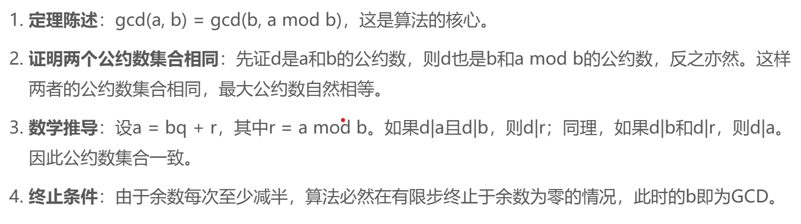
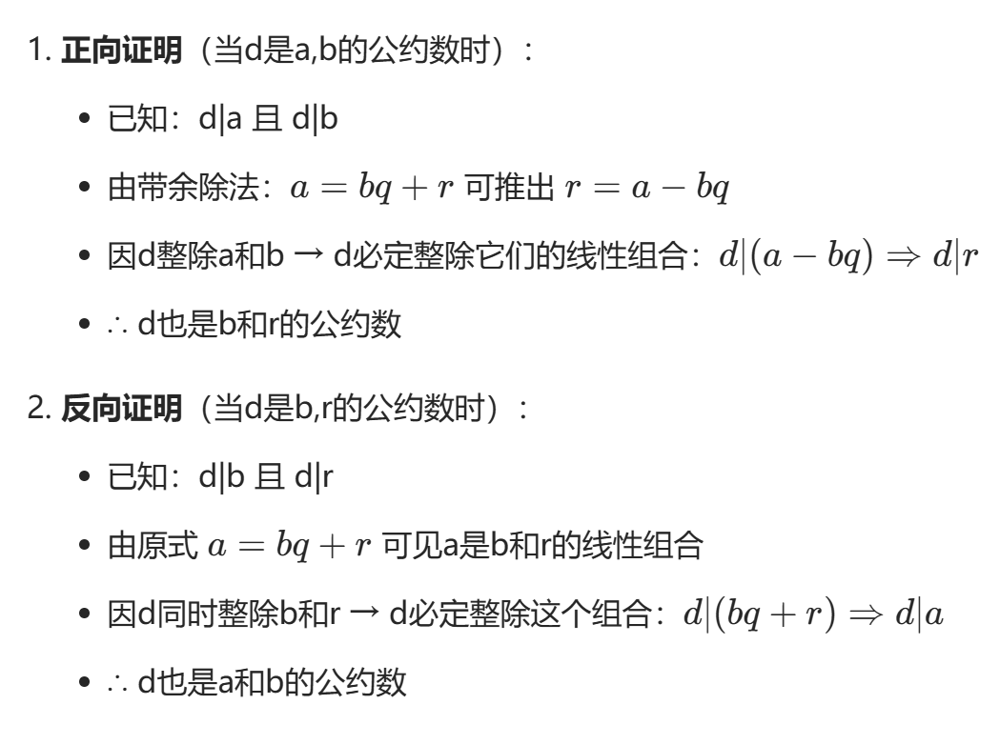
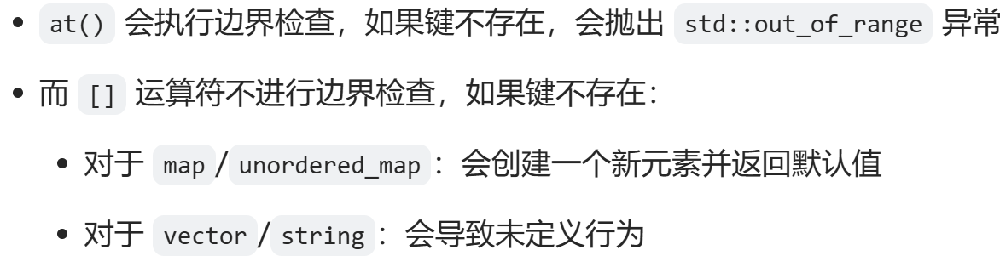

## 赛场文字技巧

1. 比赛做题节奏
    - 开场先把所有题目快速扫一遍，不要一上来就在第一题坐太久。
    - 先做一眼能写的签到题和中低档题，优先保证有分入账。
    - 如果一道题想了 20 到 30 分钟还没有清晰做法，先暂时放掉，去拿别的题的分。
    - 比赛里最怕的不是不会，而是卡在一题上把后面的简单题也耽误了。

2. 读题技巧
    - 读题时先圈出：数据范围、是否多组数据、要求输出什么、下标从 0 还是 1 开始。
    - 特别注意 `n=1`、全相等、全负数、无解、答案可能很大这几类边界。
    - 看到“最多”“最少”“是否存在”“方案数”“字典序最小”时，要立刻意识到题型可能不同。
    - 样例不只是看答案，要看它在暗示什么性质。

3. 卡题时怎么自救
    - 先问自己：我卡的是思路、证明、实现，还是复杂度。
    - 把题目的目标换一种说法，很多题换个角度就清楚了。
    - 尝试手推 3 到 5 个小样例，找规律时不要一上来就盯着大数据。
    - 想不出来时，列出你已经确定正确的性质，再尝试拼做法。
    - 如果一个做法很复杂，优先怀疑自己是否想偏了。

4. 常见题型提醒
    - 数据范围很小：优先想暴力、搜索、状压、记忆化。
    - `n` 到 `2e5`、`1e6` 级别：优先想线性、`n log n`、前缀和、差分、双指针、单调栈、二分。
    - 涉及区间修改、区间查询：先判断是前缀和、差分、树状数组还是线段树。
    - 涉及“排序后更好处理”：优先考虑贪心、双指针、离线。
    - 涉及“不断合并/连通”：考虑并查集。
    - 涉及“方案数”“模意义”：留意 DP、组合数、快速幂、逆元。

5. 写代码前先确认四件事
    - 状态和变量分别表示什么。
    - 循环顺序是否会影响正确性。
    - 是否会越界。
    - 是否会爆 `int`，该不该开 `long long`。

6. 实现细节防挂分
    - 能开 `long long` 的地方尽量别省，尤其是乘法、前缀和、答案统计。
    - 数组大小宁可多开一点，不要卡边界。
    - 多组数据时，每组都要重新初始化。
    - 排序、自定义比较函数时，先确认比较规则是否满足严格弱序。
    - 二分一定想清楚：查的是第一个满足条件的位置，还是最后一个满足条件的位置。

7. 调试顺序
    - 先看输入有没有读错。
    - 再看数组下标和循环边界。
    - 再看转移、贪心条件、判定函数是否写反。
    - 最后看是否有未初始化、爆类型、特判漏写。
    - 调不出来时，自己造最小样例，比盯着大样例更有效。

8. 赛场上的心态技巧
    - 前 30 分钟不要慌，很多人这时候也只是刚进入状态。
    - 被卡住很正常，不代表你这场不行，只代表这题暂时不适合现在做。
    - 一道题过了以后，别沉浸太久，马上回到全场视角。
    - 如果连续 WA，暂停 2 分钟重新看题，通常比继续硬改更有效。

9. 提交前检查清单
    - 是否清空了上组数据影响。
    - 是否特判了最小值和无解情况。
    - 是否有 `mid = (l + r) / 2` 溢出的风险，可以写成 `l + (r - l) / 2`。
    - 是否有除 0、取模负数、访问空容器的问题。
    - 输出格式有没有多空格、多换行、少换行。

10. 临场思路习惯
    - 先想暴力，再根据数据范围优化，不要一上来就想特别复杂的做法。
    - 如果题目要求构造，优先从小样例出发，尝试找规律和不变量。
    - 如果题目要求最值，先想贪心、二分答案、DP。
    - 如果题目要求“是否存在”，先想判定条件能不能简化。
    - 如果你已经能写出一个正确但慢的做法，说明离正解通常不远了。

11. 容易忽略的边界
    - 空数组、单元素、全相同、严格递增、严格递减。
    - 有负数、有 0、答案可能为 0。
    - 图可能不连通，树可能要从任意点开始搜。
    - 字符串可能长度为 1，或者全部字符一样。

12. 明天比赛前可以再看一遍
    - 签到题不要写挂。
    - 中档题先拿到手。
    - 卡住及时换题。
    - 少写花哨写法，优先写自己最稳的写法。
    - 每过一题都把代码再扫一眼再交。
    - 相信自己平时训练积累的东西，比赛时先把会的都拿下。


13. 比赛里推荐的代码习惯
    - 统一决定数组是从 0 开始还是从 1 开始，不要混着写。
    - 能封装成 `solve()` 就封装，方便处理多组数据。
    - 变量名尽量别全写成 `a b c d`，至少关键变量要看得出含义。
    - 写完一段循环就顺手想一下边界，避免最后集中排错。

14. 容易写挂的输入问题
    - 题目是多组数据，但你只写了一组。
    - 题目给的是字符串矩阵，你却按字符一个个读，结果格式乱了。
    - 输入里有空格，用 `cin >> s` 读不完整，应该用 `getline`。
    - 没注意 1 下标和 0 下标，建图时直接错位。

15. 赛前最实用的一句话
    - 输入先读对，边界先想对，再谈算法。
## 代码与知识点

1. #include<bits/stdc++.h>   是指：包含所有的库。
2. 双指针 :   
   看模板题目 code.md中
3. 前缀和：    
   求前i个数字的和，`sum[i]=sum[i-1]+a[i]`   [l,r]  sum[r]-sum[l-1]; 从区间查询变为区间端点的查询。    
   - 前缀和可以拓展到乘法吗  `可以但是有可能溢出`
   - 可以拓展到xor吗         `可以   (a xor b xor b) == a `
   - 可以拓展到求最大值最小值吗？ `如果前n个数，后n个数的最大值可以，但不能求区间的最大值。`
  
4. 差分：  
    对于一个数列an，有q次修改，每次都把数列中li到ri的每个元素加上一个数值ki求出所有修改后的每个数字的值。   
    用数组delta[i]来维护第i个数字和前一个数字的差值，（可以默认第一个数字前面有一个0）然后当需要对[li,ri]区间的每一个数字+ki时，只需要修改delta[li]和delta[ri+1]即可。所有的修改完成后，在对delta数组求和，就可以得到数列的每个元素的数值。
5. 位运算介绍  
    << 左移  >> 右移 |或 &与 ~取反 ^异或   
    ***注意位运算的优先级***    
    `a=a^b b=a^b a=a^b ==> swap(a,b)`
6. gcd
   > 欧几里得算法的步骤：用较大数除以较小数，再用余数替换较大数，重复直到余数为零，此时的除数就是GCD
   > d|a表示d整除a
            
   
   6.1
    ``` cpp
    #include <numeric>
    // 直接使用标准库
    int result = std::gcd(a, b);
    ```
    6.2
    ```cpp
    // 递归版本
    int gcd(int a, int b) {
        if (b == 0) return a;
        return gcd(b, a % b);
    }

    // 非递归版本
    int gcd(int a, int b) {
        while (b) {
            int temp = b;
            b = a % b;
            a = temp;
        }
        return a;
    }  
    ```
7. 加速
    ios::sync_with_stdio(0), cin.tie(0), cout.tie(0);

8. **裴蜀定理**     
   对于任意两个不全为零的整数a,b 一定存在两个整数x,y 使得 ax+by=gcd(a,b)
   裴蜀定理：对于任意两个不全为零的整数a,b 一定存在两个整数x,y 使得 ax+by=(a,b)
  exgcd 是"扩展欧几里得算法"（Extended Euclidean Algorithm）的缩写。它是欧几里得算法的扩展版本。 
    基本原理
    普通的欧几里得算法只能求两个数的最大公约数(gcd)     
    扩展欧几里得算法不仅能求gcd，还能找到裴蜀定理中的系数 x和y     
    即对于任意两个整数a和b，求解方程：ax + by = gcd(a,b)    
    > 首先，考虑a和b的最大公约数d = gcd(a, b)。根据欧几里得算法，d可以通过反复应用除法算法得到，每一步的余数都可以表示为a和b的线性组合。例如，在欧几里得算法的最后一步，余数为0，此时最后的非零余数就是d。这表明d可以写成a和b的线性组合，因此存在整数x和y使得ax + by = d。
    ```cpp 
    int exgcd(int a, int b, int &x, int &y) {
    if (b == 0) {
        x = 1;
        y = 0;
        return a;
    }
    int d = exgcd(b, a % b, y, x);
    y -= (a / b) * x;
    return d;
    }
    ```

9. **连续递增的值填充**
    iota 是 C++ STL 中的一个算法，定义在 <numeric> 头文件中。它的作用是用连续递增的值填充一个范围。
    功能上：   
    ```cpp
    iota(b.begin(), b.end(), 0);

    for(int i = 0; i < b.size(); i++) {
        b[i] = i;
    }
    ```
```cpp
#include<bits/stdc++.h>
using namespace std;

bool com(const pair<int,int> &a, const pair<int,int> &b) {
    return a.first < b.first;
}

bool comp(const pair<int,int> &a, const pair<int,int> &b) {
    return a.second < b.second;
}

int main() {
    ios::sync_with_stdio(false);
    cin.tie(nullptr);
    
    int T;
    cin >> T;
    while(T--) {
        int n, k;
        cin >> n >> k;
         
        vector<pair<int,int>> a(n+1), b(n+1);
        a[0]=b[0]={-1,-1};
        for(int i = 1; i <= n; i++) {
            int tmp;
            cin >> tmp;
            a[i] = {tmp, i};
        }
        
        if(k < n ) {
            cout << "-1\n";
            continue;
        } 
        auto sum = 1ll * n * (n + 1ll) / 2;
        
        sort(a.begin(), a.end(), com);
        for(int i = 1; i <= n; i++) {
            b[i] = {i, a[i].second};
        } 
        int x = n;
        while(sum > k && x > 1){
            if(sum - k <= x - 1){
                int t = sum - k;
                sum = k;
                swap(b[1], b[t + 1]);
            }
            int t = x + x - 3;
            if(sum - t >= k){
                sum -= t;
                swap(b[x], b[x - 1]);
                x -= 1;
            }
            x -= 1;
        }
        if(sum != k){
            b[1].first = 3;
            b[2].first = 4;
            b[3].first = 1;
            b[4].first = 2;
            sum = k;
        }
          
        sort(b.begin(), b.end(), comp);
        for(int i = 1; i <= n; i++) {
            cout << b[i].first << ' ';
        }
        cout<<endl;
    }
    return 0;
}
```
10. 将数字转换为string
    ```cpp
    // 方法1：std::to_string()
    int num = 123;
    string str = std::to_string(num);

    // 方法2：stringstream
    #include <sstream>
    int num = 123;
    stringstream ss;    
    ss << num;
    string str = ss.str();

    ```
11. threesum 问题可以通过双指针减少时间复杂度
    可以使用一个i来固定最左边的坐标，left=i+1,right=len-1  不断遍历，可以减少时间复杂度。
    
12. 递归回溯
    递归：函数直接或间接调用自身的过程
    回溯：当探索的路径不满足条件时，退回到上一步，尝试另一条路径
13. KMP
    在 KMP 算法中，我们特别关注的是相同的前缀和后缀。具体来说，对于模式串的每个位置 i，我们需要找出：最长相同前缀后缀：在位置 i 之前的子串中，有多长的前缀与后缀是相同的。    **(略难，请反复回顾)**

14. isalnum()函数是一个字符检测函数，用于检查字符是否为字母数字字符（即字母或数字）。这个函数在多种编程语言中都有实现.

15. 快速乘算法
    快速乘算法是一种不使用乘法运算符而实现乘法的高效算法，主要基于二进制分解和加法运算。这种算法在特定场景（如不允许使用乘法运算符或需要处理大数乘法）中非常有用。

16. lamda表达式
    `[capture_clause](parameters) -> return_type { body }`     
17. Brian Kernighan 算法
    可以在一定程度上进一步提升计算速度。Brian Kernighan 算法的原理是：对于任意整数 x，令 x=x & (x−1)，该运算将 x 的二进制表示的最后一个 1 变成 0。因此，对 x 重复该操作，直到 x 变成 0，则操作次数即为 x 的「一比特数」。
 
 18. `pop_back()`
    用于删除最后一个元素
19. `at()`
       
    at() 更安全，但可能有轻微的性能开销
    [] 更高效，但不安全
20. string 
    ```
    C++提供了许多类似的字符和字符串处理函数，以下是一些常用的相关函数：

### 字符转换函数

1. **`std::toupper`** - 将字符转换为大写
   ```cpp
   #include <cctype>
   char c = 'a';
   char uppercase_c = std::toupper(c);  // 结果: 'A'
   ```

2. **`std::islower`** - 检查字符是否为小写字母
   ```cpp
   bool is_lower = std::islower('a');  // true
   ```

3. **`std::isupper`** - 检查字符是否为大写字母
   ```cpp
   bool is_upper = std::isupper('A');  // true
   ```

### 字符分类函数

4. **`std::isalpha`** - 检查字符是否为字母
   ```cpp
   bool is_alpha = std::isalpha('a');  // true
   ```

5. **`std::isdigit`** - 检查字符是否为数字
   ```cpp
   bool is_digit = std::isdigit('5');  // true
   ```

6. **`std::isalnum`** - 检查字符是否为字母或数字
   ```cpp
   bool is_alnum = std::isalnum('a');  // true
   bool is_alnum2 = std::isalnum('7');  // true
   ```

7. **`std::isspace`** - 检查字符是否为空白字符（空格、制表符、换行符等）
   ```cpp
   bool is_space = std::isspace(' ');  // true
   ```

8. **`std::ispunct`** - 检查字符是否为标点符号
   ```cpp
   bool is_punct = std::ispunct('.');  // true
   ```

### 字符串处理函数 (C++标准库)

9. **`std::string::substr`** - 获取子字符串
   ```cpp
   std::string str = "Hello World";
   std::string sub = str.substr(6, 5);  // "World"
   ```

10. **`std::string::find`** - 查找子字符串
    ```cpp
    std::string str = "Hello World";
    size_t pos = str.find("World");  // 6
    ```

11. **`std::string::replace`** - 替换子字符串
    ```cpp
    std::string str = "Hello World";
    str.replace(6, 5, "C++");  // "Hello C++"
    ```

### 算法库中的字符串处理函数

12. **`std::transform`** - 可用于各种字符转换
    ```cpp
    #include <algorithm>
    std::string str = "hello";
    std::transform(str.begin(), str.end(), str.begin(), ::toupper);  // "HELLO"
    ```

13. **`std::count`** - 计算特定字符出现次数
    ```cpp
    std::string str = "Hello";
    int count = std::count(str.begin(), str.end(), 'l');  // 2
    ```

14. **`std::remove`** 和 **`std::remove_if`** - 移除特定字符
    ```cpp
    std::string str = "Hello World";
    str.erase(std::remove(str.begin(), str.end(), ' '), str.end());  // "HelloWorld"
    
    // 移除所有数字
    std::string str2 = "abc123def";
    str2.erase(std::remove_if(str2.begin(), str2.end(), ::isdigit), str2.end());  // "abcdef"
    ```

### C风格字符串函数 (需要 `<cstring>`)

15. **`std::strcpy`** - 复制字符串
16. **`std::strcat`** - 连接字符串
17. **`std::strcmp`** - 比较字符串
18. **`std::strlen`** - 获取字符串长度

    所有这些函数都是处理字符和字符串的有用工具，可以根据具体需求选择合适的函数。对于现代C++编程，建议优先使用`std::string`和标准库算法，而不是C风格的字符串函数。

### 加速输入输出
```cpp
// 优化输入输出速度
    ios_base::sync_with_stdio(false);
    cin.tie(NULL);
```


31. ACM 模式基础模板
    ```cpp
    #include <bits/stdc++.h>
    using namespace std;
    using ll = long long;

    int main() {
        ios::sync_with_stdio(false);
        cin.tie(nullptr);

        return 0;
    }
    ```

32. 读一个整数
    ```cpp
    int n;
    cin >> n;
    ```

33. 读两个整数
    ```cpp
    int a, b;
    cin >> a >> b;
    ```

34. 读一行字符串
    ```cpp
    string s;
    getline(cin, s);
    ```
    - 如果前面用了 `cin >>`，再用 `getline` 之前要先吃掉换行。
    ```cpp
    int n;
    cin >> n;
    cin.ignore();
    string s;
    getline(cin, s);
    ```

35. 读多个字符串或数字直到文件结束
    ```cpp
    int x;
    while (cin >> x) {
        cout << x << '\n';
    }
    ```
    - 这种写法常用于不知道有多少组数据的题。

36. 多组测试数据
    ```cpp
    int T;
    cin >> T;
    while (T--) {
        solve();
    }
    ```
    ```cpp
    void solve() {
        int n;
        cin >> n;
    }
    ```

37. 读长度为 n 的数组
    ```cpp
    int n;
    cin >> n;
    vector<int> a(n);
    for (int i = 0; i < n; i++) cin >> a[i];
    ```
    - 如果你习惯下标从 1 开始：
    ```cpp
    int n;
    cin >> n;
    vector<int> a(n + 1);
    for (int i = 1; i <= n; i++) cin >> a[i];
    ```

38. 读二维数组
    ```cpp
    int n, m;
    cin >> n >> m;
    vector<vector<int>> a(n, vector<int>(m));
    for (int i = 0; i < n; i++) {
        for (int j = 0; j < m; j++) {
            cin >> a[i][j];
        }
    }
    ```

39. 读字符矩阵
    ```cpp
    int n, m;
    cin >> n >> m;
    vector<string> g(n);
    for (int i = 0; i < n; i++) cin >> g[i];
    ```

40. 每行有很多数字，整行读入再拆分
    ```cpp
    string line;
    getline(cin, line);
    stringstream ss(line);
    int x;
    while (ss >> x) {
    }
    ```
    - 适合一行数字个数不固定的情况。

41. 读一对 pair
    ```cpp
    int x, y;
    cin >> x >> y;
    pair<int, int> p = {x, y};
    ```

42. 读边，建图
    ```cpp
    int n, m;
    cin >> n >> m;
    vector<vector<int>> g(n + 1);
    for (int i = 0; i < m; i++) {
        int u, v;
        cin >> u >> v;
        g[u].push_back(v);
        g[v].push_back(u);
    }
    ```
    - 有向图就删掉反向那句。

43. 带权图输入
    ```cpp
    int n, m;
    cin >> n >> m;
    vector<vector<pair<int, int>>> g(n + 1);
    for (int i = 0; i < m; i++) {
        int u, v, w;
        cin >> u >> v >> w;
        g[u].push_back({v, w});
        g[v].push_back({u, w});
    }
    ```

44. 输出数组
    ```cpp
    for (int i = 0; i < n; i++) {
        cout << a[i] << " \n"[i == n - 1];
    }
    ```
    - 这个写法可以避免最后一个数后面多空格。

45. 输出 `YES` / `NO`
    ```cpp
    cout << "YES\n";
    cout << "NO\n";
    ```
    - 题目让输出什么大小写，就严格按题目来。

46. `int` 还是 `long long`
    - 如果有乘法、前缀和、答案统计、组合数，优先想 `long long`。
    - `1e9 * 1e9` 一定爆 `int`。
    ```cpp
    long long ans = 1LL * a * b;
    ```

47. `cin` 和 `getline` 混用注意
    - `cin >>` 会留下换行符。
    - 下一次直接 `getline` 时，可能会读到一个空串。
    - 常用处理：
    ```cpp
    cin.ignore(numeric_limits<streamsize>::max(), '\n');
    ```

48. 字符串转数字
    ```cpp
    string s = "123";
    int x = stoi(s);
    long long y = stoll(s);
    ```

49. 数字转字符串
    ```cpp
    int x = 123;
    string s = to_string(x);
    ```

50. 保留小数输出
    ```cpp
    double x = 3.1415926;
    cout << fixed << setprecision(6) << x << '\n';
    ```
    - 需要头文件 `<iomanip>`，不过 `bits/stdc++.h` 已经包含了。

51. 常用 `solve()` 写法
    ```cpp
    void solve() {
        int n;
        cin >> n;
        vector<int> a(n);
        for (int i = 0; i < n; i++) cin >> a[i];
    }

    int main() {
        ios::sync_with_stdio(false);
        cin.tie(nullptr);

        int T;
        cin >> T;
        while (T--) solve();
        return 0;
    }
    ```


52. 比赛里常用头文件
    - `#include <iostream>`：`cin`、`cout`
    - `#include <vector>`：`vector`
    - `#include <string>`：`string`
    - `#include <algorithm>`：`sort`、`reverse`、`max`、`min`、`lower_bound`、`upper_bound`
    - `#include <queue>`：`queue`、`priority_queue`
    - `#include <stack>`：`stack`
    - `#include <set>`：`set`、`multiset`
    - `#include <map>`：`map`、`multimap`
    - `#include <unordered_set>`：`unordered_set`
    - `#include <unordered_map>`：`unordered_map`
    - `#include <deque>`：`deque`
    - `#include <cmath>`：`sqrt`、`pow`、`abs`
    - `#include <cstring>`：`memset`
    - `#include <numeric>`：`gcd`、`lcm`、`accumulate`、`iota`
    - `#include <iomanip>`：`fixed`、`setprecision`
    - `#include <sstream>`：`stringstream`
    - `#include <bitset>`：`bitset`
    - `#include <climits>`：`INT_MAX`、`LLONG_MAX`
    - `#include <cctype>`：`isdigit`、`isalpha`、`tolower`、`toupper`
    - `#include <functional>`：`greater<>`

53. 最常用的一套头文件
    ```cpp
    #include <iostream>
    #include <vector>
    #include <string>
    #include <algorithm>
    #include <queue>
    #include <stack>
    #include <set>
    #include <map>
    #include <unordered_map>
    #include <unordered_set>
    #include <cmath>
    #include <cstring>
    #include <numeric>
    using namespace std;
    ```

54. 几个最需要记住的对应关系
    - 排序、二分、翻转：`<algorithm>`
    - 最大公约数、最小公倍数、累加：`<numeric>`
    - 精度输出：`<iomanip>`
    - 字符判断：`<cctype>`
    - 清空数组：`<cstring>`
    - 优先队列：`<queue>`
    - 哈希表：`<unordered_map>`

55. `bits/stdc++.h`
    - `#include <bits/stdc++.h>` 基本相当于把常用标准库都包含了。
    - 写题很方便，但它不是标准 C++ 头文件，而是 GNU 的扩展。
    - 如果比赛环境支持 GCC，一般都能用。
    - 如果想写得最稳，就手动写上面这些常用头文件。

56. 常用数据结构速查

### `vector`
- 头文件：`#include <vector>`
- 作用：动态数组
- 声明：
```cpp
vector<int> a;
vector<int> b(n);
vector<int> c(n, 0);
```
- 常用函数：
```cpp
a.push_back(x);
a.pop_back();
a.size();
a.empty();
a.clear();
a.front();
a.back();
a[i];
a.begin(), a.end();
```
- 常见操作：
```cpp
sort(a.begin(), a.end());
reverse(a.begin(), a.end());
```

### `string`
- 头文件：`#include <string>`
- 作用：字符串
- 声明：
```cpp
string s;
string t = "abc";
```
- 常用函数：
```cpp
s.size();
s.empty();
s.clear();
s.push_back('a');
s.pop_back();
s.substr(pos, len);
s.find("abc");
s.erase(pos, len);
s.insert(pos, "abc");
s.front();
s.back();
```

### `pair`
- 头文件：`#include <utility>`
- 作用：把两个值放在一起
- 声明：
```cpp
pair<int, int> p;
pair<int, int> q = {1, 2};
auto t = make_pair(3, 4);
```
- 常用成员：
```cpp
p.first;
p.second;
```

### `queue`
- 头文件：`#include <queue>`
- 作用：队列，先进先出
- 声明：
```cpp
queue<int> q;
```
- 常用函数：
```cpp
q.push(x);
q.pop();
q.front();
q.back();
q.size();
q.empty();
```

### `stack`
- 头文件：`#include <stack>`
- 作用：栈，后进先出
- 声明：
```cpp
stack<int> st;
```
- 常用函数：
```cpp
st.push(x);
st.pop();
st.top();
st.size();
st.empty();
```

### `deque`
- 头文件：`#include <deque>`
- 作用：双端队列
- 声明：
```cpp
deque<int> dq;
```
- 常用函数：
```cpp
dq.push_back(x);
dq.push_front(x);
dq.pop_back();
dq.pop_front();
dq.front();
dq.back();
dq.size();
dq.empty();
```

### `priority_queue`
- 头文件：`#include <queue>`
- 作用：优先队列，默认大根堆
- 声明：
```cpp
priority_queue<int> q1;
priority_queue<int, vector<int>, greater<int>> q2;
```
- 常用函数：
```cpp
q1.push(x);
q1.pop();
q1.top();
q1.size();
q1.empty();
```

### `set`
- 头文件：`#include <set>`
- 作用：自动排序，不重复
- 声明：
```cpp
set<int> s;
multiset<int> ms;
```
- 常用函数：
```cpp
s.insert(x);
s.erase(x);
s.count(x);
s.find(x);
s.size();
s.empty();
s.clear();
```
- 常见操作：
```cpp
s.lower_bound(x);
s.upper_bound(x);
```
- 说明：`set` 不重复，`multiset` 可重复。

### `map`
- 头文件：`#include <map>`
- 作用：键值对，按 key 自动排序
- 声明：
```cpp
map<string, int> mp;
multimap<int, int> mm;
```
- 常用函数：
```cpp
mp[key] = value;
mp.count(key);
mp.find(key);
mp.erase(key);
mp.size();
mp.empty();
mp.clear();
```
- 遍历：
```cpp
for (auto [k, v] : mp) {
}
```

### `unordered_set`
- 头文件：`#include <unordered_set>`
- 作用：哈希集合，无序
- 声明：
```cpp
unordered_set<int> s;
```
- 常用函数：
```cpp
s.insert(x);
s.erase(x);
s.count(x);
s.find(x);
s.size();
s.empty();
```

### `unordered_map`
- 头文件：`#include <unordered_map>`
- 作用：哈希表，无序
- 声明：
```cpp
unordered_map<string, int> mp;
```
- 常用函数：
```cpp
mp[key] = value;
mp.count(key);
mp.find(key);
mp.erase(key);
mp.size();
mp.empty();
```
- 说明：平均查询复杂度通常是 `O(1)`。

### `bitset`
- 头文件：`#include <bitset>`
- 作用：定长二进制位集合
- 声明：
```cpp
bitset<1000> bs;
```
- 常用函数：
```cpp
bs.set();
bs.reset();
bs.flip();
bs.count();
bs.any();
bs.none();
bs[i];
```

57. 数据结构常见搭配
- 图的邻接表：`vector<vector<int>> g(n + 1);`
- 带权图：`vector<vector<pair<int, int>>> g(n + 1);`
- 计数：`map<int, int>` 或 `unordered_map<int, int>`
- 判重：`set<int>` 或 `unordered_set<int>`
- 单调队列：`deque<int>`
- 动态维护最小值/最大值：`priority_queue`

58. 比赛里怎么选
- 需要随机访问，优先 `vector`
- 需要先进先出，选 `queue`
- 需要后进先出，选 `stack`
- 需要双端操作，选 `deque`
- 需要自动排序且去重，选 `set`
- 需要键值映射，选 `map`
- 需要更快查询且不关心顺序，选 `unordered_map` / `unordered_set`
- 需要一直取最小值或最大值，选 `priority_queue`

59. 容易写错的点
- `queue` 没有 `top()`，只有 `front()`
- `stack` 没有 `front()`，只有 `top()`
- `priority_queue` 默认是大根堆
- `map[key]` 如果 key 不存在，会自动创建
- `set` / `map` 的 `find` 返回的是迭代器，不是下标
- `vector::erase()` 删除中间元素代价较高，不适合频繁删除中间元素
