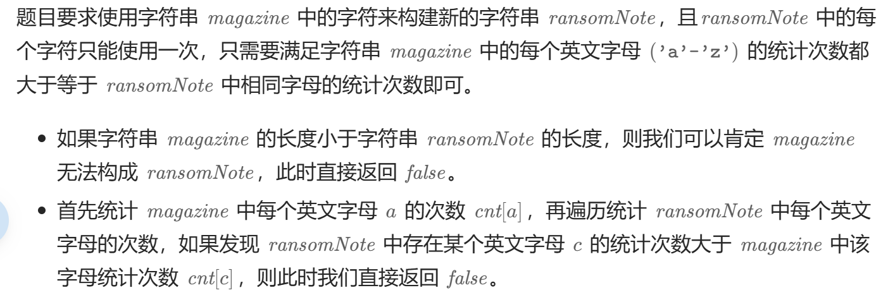

### 题解由个人总结，仅供参考
#### **15_THREESUMS**
    题目：三个数的和为0，求解这三个数字的集合。
    可以利用双指针来进行优化。
#### **16_最接近的三数之和**
    题目，给出一个数组，三个数字求和，使得这个和最接近target
    似乎应该使用双指针。
    题解：使用双指针，遍历，当sum>target 的时候，r左移，<的时候，l右移，=结束，每次都进行比较以及更新数字。

#### **17_电话号码的数字组合**
1. 回溯法
```cpp
    class Solution {
public:
    vector<string> letterCombinations(string digits) {
        vector<string> combinations;
        if (digits.empty()) {
            return combinations;
        }
        unordered_map<char, string> phoneMap{
            {'2', "abc"},
            {'3', "def"},
            {'4', "ghi"},
            {'5', "jkl"},
            {'6', "mno"},
            {'7', "pqrs"},
            {'8', "tuv"},
            {'9', "wxyz"}
        };
        string combination;
        backtrack(combinations, phoneMap, digits, 0, combination);
        return combinations;
    }

    void backtrack(vector<string>& combinations, const unordered_map<char, string>& phoneMap, const string& digits, int index, string& combination) {
        if (index == digits.length()) {
            combinations.push_back(combination);
        } else {
            char digit = digits[index];
            const string& letters = phoneMap.at(digit);
            for (const char& letter: letters) {
                combination.push_back(letter);
                backtrack(combinations, phoneMap, digits, index + 1, combination);
                combination.pop_back();
            }
        }
    }
};

```
#### **258_各相位相加**    
    数根又称数字根（Digital root），是自然数的一种性质，每个自然数都有一个数根。
    对于给定的自然数，反复将各个位上的数字相加，直到结果为一位数，则该一位数即为原自然数的数根。

求解该数字根：
1. 模拟，不断循环求解
2. 
3. 思路同上，但细节上进行了简化
```cpp
 class Solution {
    public int addDigits(int num) {
        return (num - 1) % 9 + 1;
    }
} 
```
#### **26.删除有序数组中的重复项**
    给你一个 非严格递增排列 的数组 nums ，请你 原地 删除重复出现的元素，使每个元素 只出现一次 ，返回删除后数组的新长度。元素的 相对顺序 应该保持 一致 。然后返回 nums 中唯一元素的个数。

    思路：一般而言会采用遍历，当遇到重复的数字时候删除的算法。但是时间复杂度较高。
    所以可以采用记录重复的数字的个数，将不重复的数字赋值到前面的算法，避免了删除的麻烦。

#### **28.找出字符串第一个匹配项的下标**
    显而易见的KMP，可惜不会。

#### **70.爬楼梯**
    假设你正在爬楼梯。需要 n 阶你才能到达楼顶。 每次你可以爬 1 或 2 个台阶。你有多少种不同的方法可以爬到楼顶呢？

    我们用 f(x) 表示爬到第 x 级台阶的方案数，考虑最后一步可能跨了一级台阶，也可能跨了两级台阶，所以我们可以列出如下式子：
    f(x)=f(x−1)+f(x−2)
    
#### **100.相同的树**
    判断是不是相同的树
    利用递归；

#### **101.对称的树**
    判断树是不是对称，与上题同理；

#### **104.二叉树的最大深度**
    如题，还是递归；

#### **108.将有序数组转换为平衡二叉搜索树**
    思路：二份与递归结合
```cpp
    class Solution {
public:
    TreeNode* sortedArrayToBST(vector<int>& nums) {
        return helper(nums, 0, nums.size() - 1);
    }

    TreeNode* helper(vector<int>& nums, int left, int right) {
        if (left > right) {
            return nullptr;
        }

        // 总是选择中间位置左边的数字作为根节点
        int mid = (left + right) / 2;

        TreeNode* root = new TreeNode(nums[mid]);
        root->left = helper(nums, left, mid - 1);
        root->right = helper(nums, mid + 1, right);
        return root;
    }
};
```

#### **109.判断是不是平衡二叉树**
    通过判断根的左右树高度差是不是小于等于1，且左右两棵树是否平衡
    递归
#### **110.二叉树的最小深度**
    递归
    循环：  要善用队列


#### **112.路径总和**
    递归加循环；
    用队列存储每条路径上的数值和。

#### **118.杨辉三角形**
    二维数组存储每一行的数据
    滚动数组存储前一行和当前行的信息。
[官解](https://leetcode.cn/problems/pascals-triangle-ii/)    


#### **136.只出现一次的数字**
    可以用常数数组；
    下面这个简直天才解法；
```cpp
int singleNumber(vector<int>& nums) {
    int result = 0;
    for(auto num:nums)
    {
        result^=num;
    }
    return result;
}
```

#### **141.环形指针**
    快慢指针

####  **二叉树的前中后-层次遍历**
    递归加循环

#### **190.颠倒32位的二进制位**
    (1)逐位颠倒     


    (2)位分治
    若要翻转一个二进制串，可以将其均分成左右两部分，对每部分递归执行翻转操作，然后将左半部分拼在右半部分的后面，即完成了翻转。由于左右两部分的计算方式是相似的，利用位掩码和位移运算，我们可以自底向上地完成这一分治流程。
```cpp
class Solution {
private:
    const uint32_t M1 = 0x55555555; // 01010101010101010101010101010101
    const uint32_t M2 = 0x33333333; // 00110011001100110011001100110011
    const uint32_t M4 = 0x0f0f0f0f; // 00001111000011110000111100001111
    const uint32_t M8 = 0x00ff00ff; // 00000000111111110000000011111111
    //掩码
public:
    uint32_t reverseBits(uint32_t n) {
        n = n >> 1 & M1 | (n & M1) << 1;
        n = n >> 2 & M2 | (n & M2) << 2;
        n = n >> 4 & M4 | (n & M4) << 4;
        n = n >> 8 & M8 | (n & M8) << 8;
        return n >> 16 | n << 16;
    }
};
``` 
    (3) 调用库
```cpp
class Solution {
public:
    uint32_t reverseBits(uint32_t n) {
        string n_bin = bitset<32>(n).to_string();
        reverse(n_bin.begin(), n_bin.end());
        return static_cast<uint32_t>(bitset<32>(n_bin).to_ulong());
    }
};
```

#### **202.快乐数**
    int n 每个数字的平方和循环求解后是否为1

#### **203.移除链表元素**
    构造一个虚拟头节点


#### **205.同构字符串**
    需要我们判断 s 和 t 每个位置上的字符是否都一一对应，即 s 的任意一个字符被 t 中唯一的字符对应，同时 t 的任意一个字符被 s 中唯一的字符对应。这也被称为「双射」的关系。
    
    s 中的每个字符都可以按照一定规则映射到 t 中的字符
    每个字符只能映射到另一个字符
    不同字符不能映射到同一个字符上
    映射必须是双向的（一一对应）

#### **383.赎金信**
    题目描述：
    给你两个字符串：ransomNote 和 magazine ，判断 ransomNote 能不能由 magazine 里面的字符构成。如果可以，返回 true ；否则返回 false 。magazine 中的每个字符只能在 ransomNote 中使用一次。

 
1. 可以排序，后对字符串进行遍历检查。
2.      
   
#### **405.数字转变为16进制**
位运算：题目要求将给定的整数 num 转换为十六进制数，负整数使用补码运算方法。   
在补码运算中，最高位表示符号位，符号位是 0 表示正整数和零，符号位是 1 表示负整数。32 位有符号整数的二进制数有 32 位，由于一位十六进制数对应四位二进制数，因此 32 位有符号整数的十六进制数有 8 位。将 num 的二进制数按照四位一组分成 8 组，依次将每一组转换为对应的十六进制数，即可得到 num 的十六进制数。
```cpp
class Solution {
public:
    string toHex(int num) {
        if (num == 0) {
            return "0";
        }
        string sb;
        for (int i = 7; i >= 0; i --) {
            int val = (num >> (4 * i)) & 0xf;
            if (sb.length() > 0 || val > 0) {
                char digit = val < 10 ? (char) ('0' + val) : (char) ('a' + val - 10);
                sb.push_back(digit);
            }
        }
        return sb;
    }
};
 
```

#### **434.字符串中的单词数**
```cpp
istringstream iss(s);
        string word;
        int re=0;

        while(iss >> word)
        {
            re++;
        }
```
    istringstream 将字符串转变为字符串流

继承关系

    istringstream 是 stringstream 的特化版本
    stringstream 继承自 iostream（同时支持输入和输出）
    istringstream 继承自 istream（仅支持输入）

功能范围

    stringstream：支持读取和写入操作
    istringstream：仅支持读取操作
头文件   

    两者都在 <sstream> 头文件中定义

#### **492.构造矩形**
```cpp
class Solution {
public:
    vector<int> constructRectangle(int area) {
        int w = sqrt(1.0*area);
        while (area % w) {
            --w;
        }
        return {area / w, w};
    }
};
```
时间复杂度较低


