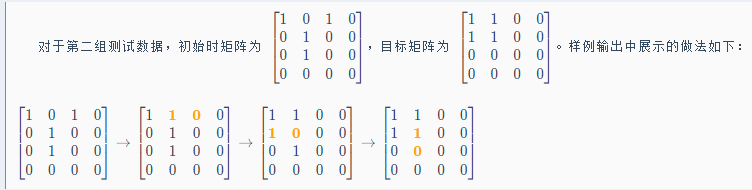

### [井然有序之排](https://ac.nowcoder.com/acm/contest/95323/H)  

题目描述：  
构造一个长度为 n 的排列，需要满足第 i 个元素的范围在 [ 𝑙 𝑖, 𝑟 𝑖 ]  范围内。

思路：  

1. 排列：  
    每个元素先占据较小的区间。  
    即：左界和右界为两个操作数，先按照左界排序，再对右界进行排序；之后从一开始向n，放入元素，如果不成立，则不满足。  
      
2. 将上一个数字m,即从[m，x]没用完的区间和[m+1,x]区间进行对比，找出右界更小的区间。  
3. 此刻需要一个容器来进行存储并比较，支持：存储以及取出最小的那个（堆）。
4. 在优先队列(可以放下当前数字的所有的区间)内存储右端点和索引： `priority-queue<r ,pos>`
    
 

数据结构：
>   `priority-queue` 优先级队列   可以按照自己的需要进行排列。

### 建筑抢修
题目描述：
n个建筑受到损伤。但只有一个建筑工人，可以瞬间到达任何一个建筑，但是每个建筑的修理需要时间，同时修完一个建筑才能到另一个建筑。
如果某一个建筑在一段时间内没有修理完毕，建筑就会报废。  
目标：抢修尽可能多的建筑。

思路：
- 按照ddl排序，从小到大。
- 用容器存贮 修过的建筑，能修则修。
- 不可修建，判断之前的楼修筑时间是不是比现在的长，如是则舍弃掉耗时长的楼。                             
- 在枚举ddl的同时扩大了可选的范围。

### [双生数组](https://ac.nowcoder.com/acm/contest/95323/E)
题目描述：  
拿到一个长度为偶数的数组，可以进行若干次操作，每次将一个元素加一或者减一，计算将其变为双生数组的最小操作次数。  

思路：（ a < b ）
- 小的数字向小变化，大的数字向大变化。  数据规模由n 变为 n/2 。
- 题目变化为 给出n/2个数字，将他们都移动到同一个数字的距离和的最小是多少。
解决方法:
1. 三分目标值（目标值从最小变大的过程中，距离会先减小后增大）暴力求距离和。
2. delta 法：先假设所有的数字都变成了a[1], 暴力求出所有数字到a[i]的距离和，当目标值从a[x]编导a[x+1]时候，所有a[x+1]和右边的数字都少移动了a[x+1]-a[x]步，而a[x]和左边的数字多移动了a[x+1]-a[x]步，把改变只求出来就能求出心的距离和，之后一直求最小值。  
 `当左右两侧的人数相同的时候，值最小。  则为中位数`
   
**特殊情况：两侧的中位数相同**  ：左侧减一或者右侧加一。  

### [数据膨胀之美](https://ac.nowcoder.com/acm/contest/95323/M)
题目描述：  
定义一个数组的极差为：数组的元素最大值减去最小值。
小红拿到了一个数组，她准备进行恰好一次操作：选择一个非空区间，将其中所有元素都乘以 
2。  
小红希望最小化数组的极差，你能帮帮她吗？

情况：  
如果区间只有一个数字，一定会选择最小值*2
最小值*2之后的区间极差有哪些可能？  
- max - 2*min
- 2*min - 次小值
- max - 次小值
考虑上区间， 要考虑维护*2区间的max min 和剩下区间的max min。此处利用线段树/贪心
，同时利用双指针。  


数据结构：  
- 线段树： 从最小值单独的区间，到 从最小值到次小值构成的区间，依次递增。
- *2 区间逐渐扩大，每个数字只考虑一次。
- 如果有多个最小值，逐个改变区间。从哪个最小值开始，最终都会包含所有的最小值。


### [硝基甲苯之袭](https://ac.nowcoder.com/acm/contest/95323/J)
题目描述：
链接：https://ac.nowcoder.com/acm/contest/95323/J
来源：牛客网

小苯拿到了一个由 n 个整数构成的数组{𝑎1,𝑎2,…,𝑎𝑛}{a1 ,a2​ ,…,an }，他想知道，从中任取两个元素 𝑎𝑖 和𝑎𝑗 (𝑖<𝑗) ，满足𝑎𝑖 xor ⁡𝑎𝑗=gcd(𝑎𝑖,𝑎𝑗) ai​ xor aj =gcd(ai ,aj​) 的方案数有多少？
 
思路：  
位运算的变形。  `ai^aj=gcd ==> gcd=ai^aj ==> ai^gcd=ai^ai^aj ==>  ai^gcd=aj`
cnt[ai]*cnt[aj] 是满足 ai^x=aj 的对数    但是x不一定是aiaj的gcd，如果是ans++，不是ans不变。
`j^i = j-i ? 不是恒成立`    
 

枚举gcd，如果gcd成立，* cnt[j] * cnt[i],统计出现次数：
> 所以条件 ((j-i)^j)==i 实际上就是在检查：      
    x^y = gcd(x,y)                
    (j-i)^j = i        
    为什么这样枚举是对的？因为：
    外层循环 i 枚举了所有可能的GCD值
    内层循环 j 枚举了 i 的倍数（因为如果 i 是两个数的GCD，那么这两个数一定都是 i 的倍数）   
    对于每个 j，我们通过 j-i 得到另一个数.
    然后检查这对数是否满足异或等于它们的GCD

```cpp
    // 创建计数数组,cnt[x]表示数字x在数组a中出现的次数
    vector<int> cnt(N+1);
    //我们在找满足条件的数对(x,y)，其中 y 必须是 i 的倍数
//通过这种方式，j 就会遍历 i 的所有倍数：2i, 3i, 4i, ...
//这比检查每个数是否为 i 的倍数要高效得多
     for(int i=1;i<=N;i++) {
        // 枚举i的倍数j
        for(int j=i+i;j<=N;j+=i) {
            // 检查数对(j-i,j)是否满足条件：(j-i)^j == i
            // ^表示异或运算
            if(((j-i)^j)==i) {
                // 如果满足条件,将这对数可以形成的组合数加入答案
                // cnt[j-i]*cnt[j]表示可以从这两个数字中选出的数对数量
                // 1ll的作用是确保乘法以long long类型进行计算
                ans+=1ll*cnt[j-i]*cnt[j];
            }
        }
    }
```

### [兢兢业业之移](https://ac.nowcoder.com/acm/contest/95323/C)    
题目描述：     
小红定义一个 n 行 n 列、仅由字符 ‘0’ 和‘1’ 构成的矩阵是好矩阵当且仅当矩阵满足以下两个条件：
- 矩阵的行数和列数均为偶数；
- 将矩阵平分为左上、右上、左下、右下四个区域后，四个区域大小完全一致，并且左上区域全部是 ‘1’ 字符，其余三个区域全部是 ‘0’ 字符。用数学语言来说，第 i 行第 j 列的字符为 ‘1’，当且仅当 1≤𝑖,𝑗≤𝑛2。     
现在，小红拿到了一个 01 矩阵，她每次操作可以交换两个相邻字符，请你帮小红将这个矩阵变成好矩阵。保证给出的矩阵一定有解。你需要保证操作次数不超过 𝑛3/2 ，可以证明，在该范围内至少存在一种合法解。
    

思路：    ***模拟 不走冤枉路***
先把左边的放进去，按区域处理。    
硬写。
