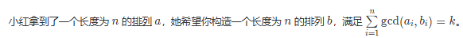
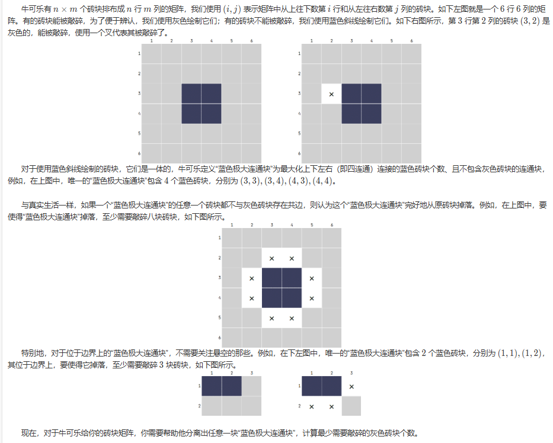
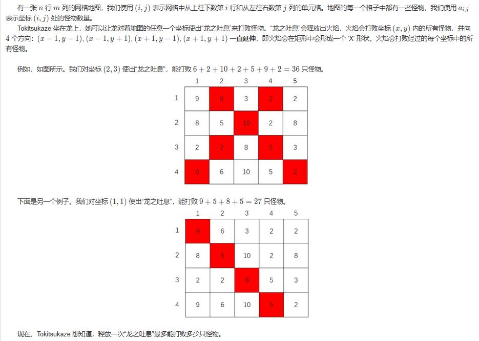

# [官方题解1](https://ac.nowcoder.com/discuss/1452662)
### [井然有序之排](https://ac.nowcoder.com/acm/contest/95323/H)  

题目描述：  
构造一个长度为 n 的排列，需要满足第 i 个元素的范围在 [ 𝑙 𝑖, 𝑟 𝑖 ]  范围内。

思路：  

1. 排列：  
    每个元素先占据较小的区间。  
    即：左界和右界为两个操作数，先按照左界排序，再对右界进行排序；之后从一开始向n，放入元素，如果不成立，则不满足。  
      
2. 将上一个数字m,即从[m，x]没用完的区间和[m+1,x]区间进行对比，找出右界更小的区间。  
3. 此刻需要一个容器来进行存储并比较，支持：存储以及取出最小的那个（堆）。
4. 在优先队列(可以放下当前数字的所有的区间)内存储右端点和索引： `priority-queue<r ,pos>`
    
 

数据结构：
>   `priority-queue` 优先级队列   可以按照自己的需要进行排列。

### 建筑抢修
题目描述：
n个建筑受到损伤。但只有一个建筑工人，可以瞬间到达任何一个建筑，但是每个建筑的修理需要时间，同时修完一个建筑才能到另一个建筑。
如果某一个建筑在一段时间内没有修理完毕，建筑就会报废。  
目标：抢修尽可能多的建筑。

思路：
- 按照ddl排序，从小到大。
- 用容器存贮 修过的建筑，能修则修。
- 不可修建，判断之前的楼修筑时间是不是比现在的长，如是则舍弃掉耗时长的楼。                             
- 在枚举ddl的同时扩大了可选的范围。

### [双生数组](https://ac.nowcoder.com/acm/contest/95323/E)
题目描述：  
拿到一个长度为偶数的数组，可以进行若干次操作，每次将一个元素加一或者减一，计算将其变为双生数组的最小操作次数。  

思路：（ a < b ）
- 小的数字向小变化，大的数字向大变化。  数据规模由n 变为 n/2 。
- 题目变化为 给出n/2个数字，将他们都移动到同一个数字的距离和的最小是多少。
解决方法:
1. 三分目标值（目标值从最小变大的过程中，距离会先减小后增大）暴力求距离和。
2. delta 法：先假设所有的数字都变成了a[1], 暴力求出所有数字到a[i]的距离和，当目标值从a[x]编导a[x+1]时候，所有a[x+1]和右边的数字都少移动了a[x+1]-a[x]步，而a[x]和左边的数字多移动了a[x+1]-a[x]步，把改变只求出来就能求出心的距离和，之后一直求最小值。  
 `当左右两侧的人数相同的时候，值最小。  则为中位数`
   
**特殊情况：两侧的中位数相同**  ：左侧减一或者右侧加一。  

### [数据膨胀之美](https://ac.nowcoder.com/acm/contest/95323/M)
题目描述：  
定义一个数组的极差为：数组的元素最大值减去最小值。
小红拿到了一个数组，她准备进行恰好一次操作：选择一个非空区间，将其中所有元素都乘以 
2。  
小红希望最小化数组的极差，你能帮帮她吗？

情况：  
如果区间只有一个数字，一定会选择最小值*2
最小值*2之后的区间极差有哪些可能？  
- max - 2*min
- 2*min - 次小值
- max - 次小值
考虑上区间， 要考虑维护*2区间的max min 和剩下区间的max min。此处利用线段树/贪心
，同时利用双指针。  


数据结构：  
- 线段树： 从最小值单独的区间，到 从最小值到次小值构成的区间，依次递增。
- *2 区间逐渐扩大，每个数字只考虑一次。
- 如果有多个最小值，逐个改变区间。从哪个最小值开始，最终都会包含所有的最小值。


### [硝基甲苯之袭](https://ac.nowcoder.com/acm/contest/95323/J)
题目描述：
链接：https://ac.nowcoder.com/acm/contest/95323/J
来源：牛客网

小苯拿到了一个由 n 个整数构成的数组{𝑎1,𝑎2,…,𝑎𝑛}{a1 ,a2​ ,…,an }，他想知道，从中任取两个元素 𝑎𝑖 和𝑎𝑗 (𝑖<𝑗) ，满足𝑎𝑖 xor ⁡𝑎𝑗=gcd(𝑎𝑖,𝑎𝑗) ai​ xor aj =gcd(ai ,aj​) 的方案数有多少？
 
思路：  
位运算的变形。  `ai^aj=gcd ==> gcd=ai^aj ==> ai^gcd=ai^ai^aj ==>  ai^gcd=aj`
cnt[ai]*cnt[aj] 是满足 ai^x=aj 的对数    但是x不一定是aiaj的gcd，如果是ans++，不是ans不变。
`j^i = j-i ? 不是恒成立`    
 

枚举gcd，如果gcd成立，* cnt[j] * cnt[i],统计出现次数：
> 所以条件 ((j-i)^j)==i 实际上就是在检查：      
    x^y = gcd(x,y)                
    (j-i)^j = i        
    为什么这样枚举是对的？因为：
    外层循环 i 枚举了所有可能的GCD值
    内层循环 j 枚举了 i 的倍数（因为如果 i 是两个数的GCD，那么这两个数一定都是 i 的倍数）   
    对于每个 j，我们通过 j-i 得到另一个数.
    然后检查这对数是否满足异或等于它们的GCD

```cpp
    // 创建计数数组,cnt[x]表示数字x在数组a中出现的次数
    vector<int> cnt(N+1);
    //我们在找满足条件的数对(x,y)，其中 y 必须是 i 的倍数
//通过这种方式，j 就会遍历 i 的所有倍数：2i, 3i, 4i, ...
//这比检查每个数是否为 i 的倍数要高效得多
     for(int i=1;i<=N;i++) {
        // 枚举i的倍数j
        for(int j=i+i;j<=N;j+=i) {
            // 检查数对(j-i,j)是否满足条件：(j-i)^j == i
            // ^表示异或运算
            if(((j-i)^j)==i) {
                // 如果满足条件,将这对数可以形成的组合数加入答案
                // cnt[j-i]*cnt[j]表示可以从这两个数字中选出的数对数量
                // 1ll的作用是确保乘法以long long类型进行计算
                ans+=1ll*cnt[j-i]*cnt[j];
            }
        }
    }
```

### [兢兢业业之移](https://ac.nowcoder.com/acm/contest/95323/C)    
题目描述：     
小红定义一个 n 行 n 列、仅由字符 ‘0’ 和‘1’ 构成的矩阵是好矩阵当且仅当矩阵满足以下两个条件：
- 矩阵的行数和列数均为偶数；
- 将矩阵平分为左上、右上、左下、右下四个区域后，四个区域大小完全一致，并且左上区域全部是 ‘1’ 字符，其余三个区域全部是 ‘0’ 字符。用数学语言来说，第 i 行第 j 列的字符为 ‘1’，当且仅当 1≤𝑖,𝑗≤𝑛2。     
现在，小红拿到了一个 01 矩阵，她每次操作可以交换两个相邻字符，请你帮小红将这个矩阵变成好矩阵。保证给出的矩阵一定有解。你需要保证操作次数不超过 𝑛3/2 ，可以证明，在该范围内至少存在一种合法解。
    

思路：    ***模拟 不走冤枉路***
先把左边的放进去，按区域处理。    
硬写。


### [双生双宿之探](https://ac.nowcoder.com/acm/contest/95323/F)    
题目描述：   
小红定义一个数组是“双生数组”，当且仅当该数组大小为偶数，数组的元素种类恰好为 2 种，且这两种元素的出现次数相同。例如 {1,1,4,4,1,4}{1,1,4,4,1,4} 是双生数组。现在小红拿到了一个数组，她希望你计算该数组有多少连续子数组是双生数组。      
子数组为从原数组中，连续的选择一段元素（可以全选、可以不选）得到的新数组。

思路：
暴力：枚举lr，计算区间是不是双生区间O(n^3)。    
优化：统计元素种类个数。    
利用前缀和进行统计。

### [硝基甲苯之魇](https://ac.nowcoder.com/acm/contest/95323/K)
题目描述：    
链接：https://ac.nowcoder.com/acm/contest/95323/K
来源：牛客网

小苯拿到了一个数组，他想知道有多少个区间满足，区间内所有元素的最大公约数恰好等于它们的异或和。   
 
思路：    
暴力处理， 枚举l和r 求区间gcd和异或和
区间gcd用线段树/ST表求，区间异或用线段树求。    
优化：   
r增大时gcd会减小，可以尝试通过分段点跳着走。 
如何分段？     
gcd线段树/ST表上二分找分界点。


### [一念神魔之耀](https://ac.nowcoder.com/acm/contest/95323/L)
题目描述：     
有 𝑙 盏灯排成一排，每盏灯要么是“开启”状态，要么是“关闭”状态。初始状态由一个长度为 𝑙 的 01 字符串 𝑠1𝑠2⋯𝑠𝑙s1 s 2​ ⋯s l​  描述，其中 𝑠𝑖=‘0’s i =‘0’ 表示第 𝑖 盏灯的状态为“关闭”，𝑠𝑖=‘1’表示第 i 盏灯的状态为“开启”。
每一轮，小红可以从以下两种操作中任选一个进行：
1. 选择连续的 x 盏灯，同时切换它们的状态，即由关闭状态变为开启状态、或由开启状态变为关闭状态；
2. 选择连续的 y 盏灯，同时切换它们的状态。
能否在某一轮操作结束后，同时打开所有灯。如果可以，请输出任意一个合法的方案。    

思路：    
- x==y  
- x!=y 能摁出来abs（x-y）长度的区间 进而不断缩短。  会将x和y化为一个数字m。
  m是gcd（x,y）
  kx+by=gcd (k>0,b<0)  则有解

  裴蜀定理：对于任意两个不全为零的整数a,b 一定存在两个整数x,y 使得 ax+by=(a,b)
  exgcd 是"扩展欧几里得算法"（Extended Euclidean Algorithm）的缩写。它是欧几里得算法的扩展版本。 
    基本原理
    普通的欧几里得算法只能求两个数的最大公约数(gcd)     
    扩展欧几里得算法不仅能求gcd，还能找到裴蜀定理中的系数 x和y     
    即对于任意两个整数a和b，求解方程：ax + by = gcd(a,b)    
  ```cpp 
    int exgcd(int a, int b, int &x, int &y) {
    if (b == 0) {
        x = 1;
        y = 0;
        return a;
    }
    int d = exgcd(b, a % b, y, x);
    y -= (a / b) * x;
    return d;
    }
  ```
- 还可以使用高斯消元 线性代数的方法    
- [原代码](https://ac.nowcoder.com/acm/contest/view-submission?submissionId=74972060)      

### [井然有序之桠](https://ac.nowcoder.com/acm/contest/95323/I)
题目描述：      
    

思路：    
首先sort排列
求和最大 n*(n+1)/2
求和最小 n

所需要的k在两者之间，所以尝试对相邻部分进行交换，减少权重，贪心求解。

# [官方题解2](https://blog.nowcoder.net/n/bc050acc1dea45878c95816796fbf1b9)    

## 省略部分题目

### [一起铸最好的剑](https://ac.nowcoder.com/acm/contest/95334/G)    

注意题目，最接近的温度。

### [数据时间](https://ac.nowcoder.com/acm/contest/95334/J)   

思路：    
使用scanf读入数据。
三段时间，分别开三个容器进行存储。    
时间可以转换为秒。

### [可以分开吗？](https://ac.nowcoder.com/acm/contest/95334/K)   

题目描述：    
思路：一道经典的搜索题，BFS、DFS都可以写，就是记录每一块边界的 0 的个数（要记得去重），然后取最小值。
*任意一块“蓝色极大连通块”，计算最少需要敲碎的灰色砖块个数*     

# [官方题解3](https://ac.nowcoder.com/discuss/1453293)
# [官方题解4](https://ac.nowcoder.com/discuss/1454096)
# [官方题解5](https://ac.nowcoder.com/acm/discuss/tutorials?tagId=288844)
# [官方题解6](https://ac.nowcoder.com/discuss/1455225)
## 省略部分题目
### [Tokitsukaze and Dragon's Breath](https://ac.nowcoder.com/acm/contest/95336/E)     
题目描述：     

存储对角线有一个小技巧： 
1. 从左上到右下的对角线满足 𝑥+𝑦 都相等。
2. 从左下到右上的对角线满足 𝑥−𝑦 都相等。

因此我们可以将每一条对角线上所有的数字之和记录下来。优化时间，

### [ Tokitsukaze and Pajama Party](https://ac.nowcoder.com/acm/contest/95336/I)


题目描述：      
已知睡衣派对的第一句歌词为 "u,uwa wa u wa""u,u wa wa u wa"
吉伊想问你，给你一个长度为 𝑛、由小写字母组成的字符串 𝑠，其中包含了多少个不同的 "u* uwawauwa" 歌词子串？其中字符 ‘*’ 代表停顿，可以匹配任意个（至少一个）字母。如果两个子串的位置不同，即视为不同。

思路：      
本质上等价于问字符串中有多少个 "ab" 子序列。                    
上述问题的做法是枚举每一个 'b' ，看这个 'b' 的前面有多少个 'a' ，记录前面有多少个 'a' 需要使用前缀和的思想。      
我们把 "u" 作为 'a' ， "uwawauwa" 看成一个整体作为 'b' ，接下来就是看这个 'b' 前面有多少个 'a' 。        
由于这里的 "*" 号至少需要占一个位置，因此我们需要看的是 'b' 的前一个位置之前有多少个 'a' 。          
可以用整型数字来记录；

### [变鸡器](https://ac.nowcoder.com/acm/contest/95338/L)     
在高中物理课堂上，我们都接触过了变鸭器，对此颇有兴趣的小火研制了一款可以处理字符串的变鸡器。
变鸡器可以对字符串进行任意次数（可以是零次）的以下操作：选择字符串中任意两个**不同**字符，将其同时删去，剩余字符按原顺序拼接起来。形式化地，变鸡器选择两个下标 𝑖,𝑗(𝑖<𝑗)，将这两个字符同时删去，剩余字符串拼接在一起得到𝑠1𝑠2⋯𝑠𝑖−1𝑠𝑖+1⋯𝑠𝑗−1𝑠𝑗+1⋯𝑠𝑛s1 s2⋯si−1si+1 ⋯sj−1sj+1 ⋯sn
​现在，小火想知道，对于给定的字符串 s，他能否通过变鸡器将该字符串变为 
"CHICKEN"。        

  
思路：       

1. 最终得到的字符串 "CHICKEN" 必然是原字符串的一个子序列。这意味着在原字符串中，字符的顺序必须保持一致。因此，检查原字符串是否能形"CHICKEN" 的关键在于它是否包含所有必要的字符，并且这些字符的顺序是正确的。
2. 字符串的长度必须为奇数。这是因为每次操作可以删除两个不同的字符，最终得到的字符串长度必须与原字符串长度的奇偶性相同。
```cpp
#include <bits/stdc++.h>
using namespace std;
#ifdef DEBUG
#include "debug.hpp"
#else
#define debug(...) void(0)
#endif
using i64 = long long;
int main() {
  cin.tie(nullptr)->sync_with_stdio(false);
  int t;
  cin >> t;
  for (int ti = 0; ti < t; ti += 1) {
    int n;
    cin >> n;
    string s;
    cin >> s;
    auto c = "CHICKEN"s;
    /*s 后缀：
    在 C++ 中，s 后缀表示将字符串字面量转换为 std::string 类型。这是 C++14 中引入的功能，允许直接使用后缀来创建 std::string 对象。
    因此，"CHICKEN"s 实际上是 std::string("CHICKEN") 的简写。*/
    int ci = 0;
    for (char si : s)
      if (ci < 7 and si == c[ci]) ci += 1;
    vector<int> count(26);
    for (char si : s) count[si - 'A'] += 1;
    for (char ci : c) count[ci - 'A'] -= 1;
    // 判断条件：
        // 1. n 为奇数
        // 2. 出现次数最多的字符的数量 * 2 <= n - 7（即剩余字符数量）
        // 3. ci == 7 确保 "CHICKEN" 的所有字符都在原字符串中被找到
    if (n % 2 and ranges::max(count) * 2 <= n - 7 and ci == 7) {
      cout << "YES\n";
    } else {
      cout << "NO\n";
    }
  }
}
```

