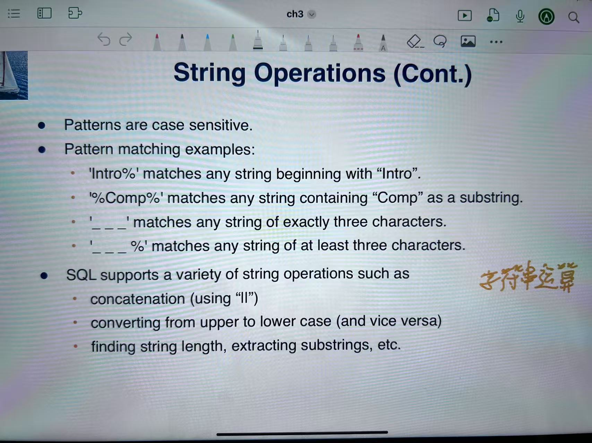

## ch1
**database systerm**
    包括相关的数据和程序以及方便的环境   
管理数据：
1. 高价值
2. 相当大
3. 经常被许多用户和应用同时访问。

问题：
   1. 数据冗余和不一致
   2. 难以存储数据
   3. 数据孤岛 大量文件和格式
   4. 约束
目标 
    数据更新
    多个用户同时访问 
    安全问题
#### DATA_MODELS
描述工具集合：
    数据
    数据关系
    数据语义
    数据约束

抽象程度：
物理层面：描述数据如何存储
逻辑层面：描述存储的数据以及关系    
视图：    隐藏数据细节的应用

physical data independence 
可在不修改逻辑模式的情况下修改物理模式

Data Definition Language
```ddl
create table instructor
(
    ID char(5),
    name varchar(20)
)
'''注意 用圆括号而不是花括号'''
```

SQL Query Language
```sql
select name
from instructor
where dept_name= 'cccc'
```
为了便于实现计算复杂的功能，sqk通常会进行内嵌处理
对语言进行拓展 嵌入书sql 进而支持sql
RDBMS提供开发API，支持调用SQL

Database Design：
逻辑设计 物理设计  

Query processor  
ddl interpreter dml compiler query elvation engine

Transaction Management  
一个事务是一系列操作的集合。

## ch2  Intro to Relational Model
### Structure of Relational Databases
attributes 属性 relation schema 关系表
relation instance r defined over R  is r(R)  r是实例

每个属性的允许值集被称为域属性
属性值需要是原子的，不可分割的。
特殊值null是每个域的元素 指示这个值是unkown

#### Relations are Unordered
元组的顺序无关紧要
#### Database Schema
Database Schema 是数据库的逻辑结构

### Keys
**K 属于 R**
如果K是能够识别R唯一元组的码， 则为超码
如果K比较小，则为候选码 candidate key
候选码中被选定的码位主码 primary key
外码 是在其他关系中出现的码
    Referencing relation 引用表
    Referenced relation 被引用表
    外码必须是被引用表的候选码
    否则不是外码而是引用关系

#### SQL 的六个基本操作（关系代数角度）

您提到的是从**关系代数**角度定义的六个基本操作，这与我之前回答的SQL语句角度不同。从关系代数理论的角度，六个基本操作确实是：

1. 选择/筛选（Selection, σ）
- 用于从关系中选择满足特定条件的元组（行）
- 相当于SQL中的 `WHERE` 子句
- 关系代数表示：σ<sub>条件</sub>(关系)
- SQL示例：
  ```sql
  SELECT * FROM Students WHERE age > 20;
  ```

2. 投影（Projection, π）
- 用于从关系中选择特定的属性（列）
- 相当于SQL中SELECT子句中的列列表
- 关系代数表示：π<sub>属性列表</sub>(关系)
- SQL示例：
  ```sql
  SELECT name, age FROM Students;
  ```

3. 并集（Union, ∪）
- 合并两个关系的元组，去除重复
- 要求两个关系的属性数量和类型相同
- 关系代数表示：关系1 ∪ 关系2
- SQL示例：
  ```sql
  SELECT * FROM Students1 UNION SELECT * FROM Students2;
  ```

4. 差集（Set Difference, -）
- 从第一个关系中删除在第二个关系中出现的元组
- 关系代数表示：关系1 - 关系2
- SQL示例：
  ```sql
  SELECT * FROM Students1 EXCEPT SELECT * FROM Students2;
  ```

5. 笛卡尔积（Cartesian Product, ×）
- 将两个关系的所有可能组合配对
- 关系代数表示：关系1 × 关系2
- SQL示例：
  ```sql
  SELECT * FROM Students, Courses;
  ```

6. 重命名（Rename, ρ）
- 为关系或属性提供新名称
- 关系代数表示：ρ<sub>新名称</sub>(关系)
- SQL示例：
  ```sql
  SELECT S.name FROM Students AS S;
  ```

 
## 关系代数与SQL对应表

| 关系代数操作 | 符号 | SQL对应 |
|------------|------|---------|
| 选择/筛选 | σ | WHERE 子句 |
| 投影 | π | SELECT 列表 |
| 并集 | ∪ | UNION |
| 差集 | - | EXCEPT 或 MINUS |
| 笛卡尔积 | × | 逗号分隔表或 CROSS JOIN |
| 重命名 | ρ | AS |
 

### Select Operation
1. 筛选 *σ*
   1. =,>,<, <=,>= !=
   2. /\ \/ --<sub>/</sub>
2. 投影 *π*
   1.  用于从关系中选择特定的属性（列）
3.  笛卡尔积
    1.  m X n = m*n 个元组
4.  并集
    1.  r U s 两者应该有相同的属性数量
5.  差
6.  重命名


## ch3 Introduction to SQL
SQL
#### domain types in sql
    char ,varchar, int , smallint, numeric,real double precision float 
    定长字符串 变长字符串 整数 小整数 定点数 浮点数和双精度浮点数 

1. create table   `用圆括号`
2. create 中要 标注 主码 外码以及reference

#### Update to tables 
*sql不区分大小写*  
insert  `插入一行数据`   
delete  
drop table  
alter  `增加属性A 数据类型为D  但不支持从表中删除属性`
```sql
alter table r add A D 
```

#### The select Clause
select列出了所有想要的属性结果。
允许在关系和查询结果中重复
删除重复元素 使用 `distinct`  
`select distinct dept_name`
关键词all指定不删除重复项
`select all dept_name`
`select *`   查询所有的属性
select 语句中可以包括运算 `+-*/`
#### The where Clause
where 子句指定了结果必须满足的条件
使用 `amd or not`
`<,<=,>,>=,=,<>`

#### the from clause
the from clause 列出了查询的涉及到的关系
可以结合笛卡尔积

#### The Rename Operation
`old-name as new-name`  

KEYWORD *`as`*  as 可以省略
#### self join example
大概是自身的笛卡尔积

#### string operation  字符串操作
- % 匹配任何子字符串
- _ 匹配任何单个字符
- like 用于字符串匹配
```sql
  select name 
  from instructor
  where name like '%dar%'
  =======================
    like '100 \%' escape '\'
```

  
#### Ordering the Display of Tuples
排序 默认升序
desc 降序 asc 升序  
`order by dept_name ,name` 先按照 dept_name 排 后按照name排序

#### where clause predicates  
`between`   
`where salary between 90000 and 100000`  
`where (instructor.ID.dept_name)=(teaches.ID,'Biology')`
#### Set Operations
集合运算 
`union 并 intersect 交 except 差`  会自动排除所有的同类相
如果要保留在最后加上 all
#### Null Value
标示未知或者不存在  
任何涉及空的算术表达式结果都是空  
谓词为空可以用于检查空值  
以及对于and 和 or  比较   
true - unknow - false

avg 平均 min 最小 max 最大 sum 求和  count 计数
#### Aggregate Functions
##### group by
`聚合函数之外的选择自居中的属性必须出现在 分组里表中`
##### having
 作为一种过滤条件 会在分组之后在过滤，  
 比较相反where是分组之前过滤
#### Nested Subqueries（嵌套子查询）   
在seect from where 中都可以嵌套

### Set Membership
集合成员
`in`  `not in`
### set Comparison
#### some clause
某一个 实例可以使得comp成立
不过 <>some   !=    not in
#### all clause
所有 
#### exists clause
存在
correlation name 相关名
correlation subquery 相关子查询
#### not exists clause
不存在

####  test for absence of duplicate tuples
检测是否存在重复元组
`unique`
如果不存在重复元组，就返回true


### Subqueries in the From Clause
#### Subqueries in the From Clause
允许在from中进行子查询
#### with clause
提供了定义临时关系的方式
```sql
with max_budget(value) as 
  (
    select max(budget)
    from department
  )
```      
#### Scalar Subquery               
标量子查询  
不过如果子查询返回多个结果，运行错误。  
#### Modification of the Database
##### Deletion
`delete from instructor`  删除所有
`where dept_name='finance'`  添加限制条件  
另外删除的时，如果有聚集函数可能会在调用过程中影响结果，最好使用with  

##### Insertion
添加新的元组
`insert into course values()`
可以将查询结果插入到表中

#### Update
```sql
update instructor
  set salary =salary *1.05
```

##### case statement for Conditional Updates
可以实现条件更新
```sql
update instructor 
  set salary = case  
      when salary <= 1000  then salary * 1.05
      else salary *1.03
      end
```
## ch4 Intermediate SQL
### Join Expression
#### Joined Relations
连接操作 对两个关系进行操作 并返回另一个关系的结果

- Natural join
- Inner join
- Outer join


#### Natural join
自然匹配连接所有有着相同value的属性 ，并且只保留每个通用列的一个副本
同名属性只出现一次
```sql
select name ,course_id
from student natural join takes

select A1,A2,A3    An
from r1 natural join r2 natural join r3 ,, natural join rn
where P
```
##### Dangerous in Natural join
不相关的属性有着相同的名字的时候，会造成困扰

**with Using clause**
替代on 简化逻辑
```sql
select name,time
from (student natural join takes) join course using (course_id)    
简化连接条件，是指前者的course_id = 后者的 course_id

```
#### Join Condition
**`on`** 根据on的条件匹配 join 元组
#### Outer Join
外连接  -- 可以避免信息的丢失
连接并且将不匹配的元组 连接到结果元组中
使用*null*  
<font face="Arial" size="4" color="lightblue">left outer join - right outer join - full outer join</font>

##### left 
  <font face="宋体" size="3" color="lightblue">把左边元组中不匹配的元组加到结果元组中 对应的值为空 </font>

##### right
同理
##### Full Outer Join 
全外连接 将左右的都合并到者的结果中  
| Join types |  
|------------|
| inner join |
| left outer join |
| right outer join |
| full outer join |

#### view 视图
在一些情况中， 不希望所有用户都能够看见完整逻辑   
视图提供了像某些用户隐藏某些数据的机制   
任何不是概念模型但是可见的关系被称为视图和虚拟关系   
 <mark> 视图不储存关系 </mark>  