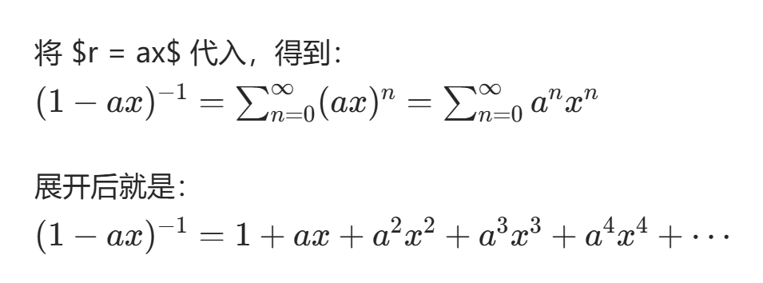

# 2 递推关系和母函数
## 递推关系
## 母函数
$G(x) = C_0 + C_1 x+C_2 x^2+···$
## Fibonacci 序列

$G(x)=\frac{x}{1-x-x^2}$
#### 若干等式
$F_1+F_2+F_3+····+F_n + F_{n+2} -1$
$F_1+F_3+F_5+····+F_{2n-1} = F_{2n}$

## 母函数的性质
1. 激活
若 
$$
b_n= 
\begin{cases}
0,&k<l \\
a_{k-l},&k>=l
\end{cases}
$$
则 $B(x)= x^l A(x)$
2. 若$b_k =a_{k+l}$ 则$B(x)=[A(x)-\sum_{k=0}^{l-1} a_kx^k]/x^l$
3. 若$b_k=\sum_{l=0}^{k}a_l$,则$B(x)=A(x)/(1-x)$